# Complete Guide: Grafana + Prometheus + Node Exporter

## 📚 Table of Contents

1. [Introduction to Monitoring](#introduction-to-monitoring)
2. [Understanding Core Concepts](#understanding-core-concepts)
3. [What is a Time Series Database (TSDB)?](#what-is-a-time-series-database-tsdb)
4. [Prometheus Deep Dive](#prometheus-deep-dive)
5. [Node Exporter Explained](#node-exporter-explained)
6. [Grafana: Visualization Platform](#grafana-visualization-platform)
7. [Installation Guide](#installation-guide)
8. [Security Configuration](#security-configuration)
9. [Working Examples](#working-examples)
10. [Advanced Configuration](#advanced-configuration)
11. [Monitoring Other Tools](#monitoring-other-tools)
12. [Troubleshooting](#troubleshooting)

---

## 🎯 Introduction to Monitoring

### Why Do We Need Monitoring?

Imagine you own a restaurant. You want to know:
- How many customers are inside right now?
- Is the kitchen too hot?
- Are tables being cleaned fast enough?
- Is food being served within 15 minutes?

**Monitoring in IT works exactly the same way!** Instead of a restaurant, you're watching:
- Servers (computers)
- Applications (software)
- Networks (data highways)
- Databases (data storage)

### What Can Go Wrong Without Monitoring?

```
🔴 Server runs out of memory → Your website crashes
🔴 CPU usage hits 100% → Everything becomes slow
🔴 Disk is 99% full → No space to save new data
🔴 Application stops responding → Users can't access services
```

### The Solution: A Monitoring Stack

A **monitoring stack** is like a team of specialists:

1. **Node Exporter** = Data Collector (like a thermometer reading temperature)
2. **Prometheus** = Data Storage & Manager (like a notebook recording all measurements)
3. **Grafana** = Display Dashboard (like a beautiful chart showing all the data)

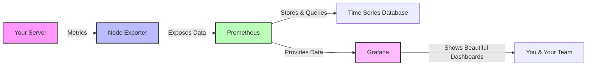

---

## 🧠 Understanding Core Concepts

### 1. Metrics

**What is a Metric?**
A metric is a measurement taken at a specific point in time.

**Real-Life Analogy:**
Think of a car dashboard:
- Speedometer shows: 60 mph (metric: speed)
- Fuel gauge shows: 50% (metric: fuel level)
- Temperature gauge shows: 90°C (metric: engine temperature)

**In IT:**
```
CPU Usage: 45%
Memory Used: 8GB out of 16GB
Disk Space: 200GB free
Network Traffic: 100 Mbps
Response Time: 250ms
```

### 2. Time Series

**What is a Time Series?**
A time series is a collection of metrics recorded over time.

**Real-Life Analogy:**
Think of recording your weight every day for a month:

| Date | Weight |
|------|--------|
| Day 1 | 70 kg |
| Day 2 | 69.8 kg |
| Day 3 | 69.5 kg |
| ... | ... |

**In IT:**
```
CPU Usage Time Series:
10:00 AM → 30%
10:05 AM → 45%
10:10 AM → 60%
10:15 AM → 55%
10:20 AM → 40%
```

### 3. Labels/Tags

**What are Labels?**
Labels are tags that add context to your metrics.

**Real-Life Analogy:**
Imagine tracking temperature in different cities:
```
Temperature{city="New York"} = 25°C
Temperature{city="London"} = 15°C
Temperature{city="Tokyo"} = 28°C
```

**In IT:**
```
http_requests_total{method="GET", path="/api/users", status="200"} = 1500
http_requests_total{method="POST", path="/api/users", status="201"} = 250
http_requests_total{method="GET", path="/api/orders", status="200"} = 3200
```

### 4. Scraping vs. Pushing

**Scraping (Pull Model)** - Prometheus uses this:
- Prometheus **actively asks** targets for data
- Like a teacher going to each student and asking "What's your score?"

**Pushing (Push Model)** - Other tools use this:
- Applications **send** data to the monitoring system
- Like students submitting their homework to the teacher

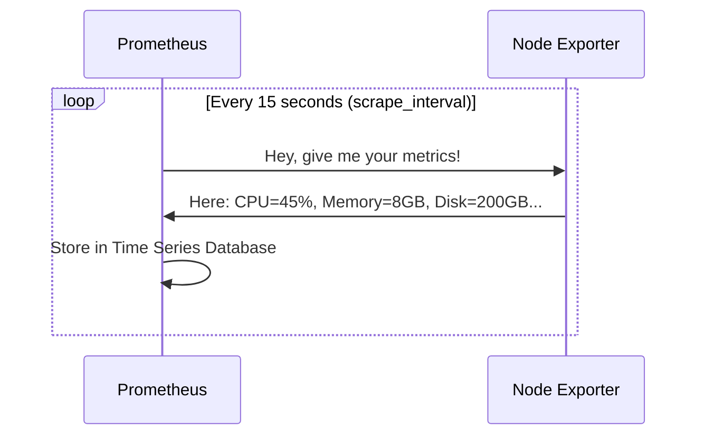

---

## 📊 What is a Time Series Database (TSDB)?

### Understanding Databases

First, let's understand what makes a Time Series Database special.

#### Regular Database (SQL)
Think of a spreadsheet:

| ID | Name | Email | Age |
|----|------|-------|-----|
| 1 | John | john@example.com | 30 |
| 2 | Jane | jane@example.com | 25 |

- Good for: User profiles, product catalogs, orders
- Each row is independent

#### Time Series Database
Think of a continuous recording:

| Timestamp | Metric | Value | Labels |
|-----------|--------|-------|--------|
| 2024-12-01 10:00:00 | cpu_usage | 45.2 | server=web-1 |
| 2024-12-01 10:00:15 | cpu_usage | 47.8 | server=web-1 |
| 2024-12-01 10:00:30 | cpu_usage | 43.1 | server=web-1 |

- Good for: Metrics, sensors, logs, monitoring
- Each row is part of a continuous series

### Why Prometheus Built Its Own TSDB

Prometheus created its own time series database because:

1. **Optimized for Monitoring Data**
   - Monitoring generates LOTS of data points
   - Need fast writes (collecting data every few seconds)
   - Need fast queries (showing dashboards quickly)

2. **Efficient Storage**
   - Uses compression techniques
   - Stores only what changes (delta encoding)
   - Groups data in 2-hour blocks

3. **Built for Reliability**
   - Local storage (no dependencies)
   - Self-contained (works independently)
   - Simple to operate

### How Prometheus TSDB Works

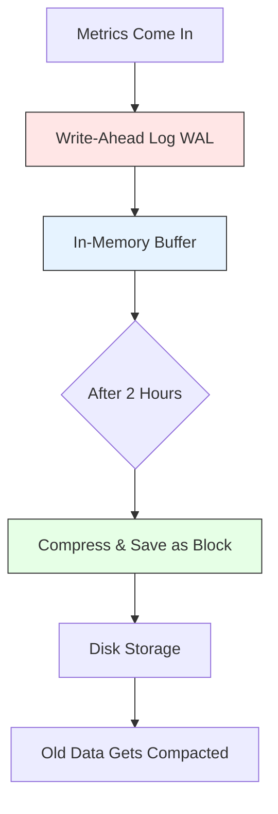

#### Data Storage Structure

```
prometheus-data/
├── 01ABCDEFGH/           # Block 1 (2 hours of data)
│   ├── chunks/
│   │   └── 000001        # Compressed time series data
│   ├── index             # Index for fast lookups
│   └── meta.json         # Block metadata
├── 01ABCDEFGI/           # Block 2
│   ├── chunks/
│   ├── index
│   └── meta.json
└── wal/                  # Write-Ahead Log (recent data)
    ├── 00000000
    └── 00000001
```

### Compression Magic

**Example: Storing CPU Usage**

Without compression:
```
10:00:00.000 → 45.234567%
10:00:15.000 → 45.345678%
10:00:30.000 → 45.456789%
10:00:45.000 → 45.567890%
```
Each entry: ~20 bytes × 4 = 80 bytes

With Prometheus compression:
```
Base: 10:00:00.000, 45.234567%
Delta: +15s, +0.111111%
Delta: +15s, +0.111111%
Delta: +15s, +0.111111%
```
Total: ~25 bytes (70% space saved!)

---

## 🔬 Prometheus Deep Dive

### What is Prometheus?

**Simple Definition:**
Prometheus is a monitoring system that collects, stores, and allows you to query metrics from your infrastructure.

**Real-Life Analogy:**
Think of Prometheus as a smart weather station:
- It has sensors everywhere (exporters)
- Records data every few minutes (scraping)
- Stores historical data (TSDB)
- Lets you ask questions like "What was the temperature at 3 PM yesterday?" (PromQL)
- Can alert you when it's too hot or cold (alerting)

### Prometheus Architecture

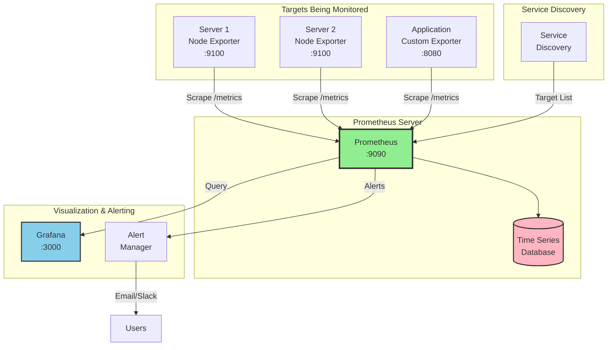

### Key Components

#### 1. Prometheus Server
- **Main component** that does everything
- Scrapes metrics from targets
- Stores data in TSDB
- Evaluates alerting rules
- Provides HTTP API for queries

#### 2. Exporters
- **Data collectors** for different systems
- Convert system metrics to Prometheus format
- Examples:
  - Node Exporter: Linux/Unix system metrics
  - MySQL Exporter: Database metrics
  - Blackbox Exporter: HTTP/HTTPS/TCP checks

#### 3. Pushgateway (Optional)
- For **short-lived jobs**
- Jobs that finish before Prometheus can scrape them
- Example: Batch jobs, cron jobs

#### 4. Alertmanager (Optional)
- Handles alerts from Prometheus
- Groups, deduplicates, and routes alerts
- Sends notifications (email, Slack, PagerDuty, etc.)

### Prometheus Data Model

Every metric in Prometheus has:

1. **Metric Name**: What you're measuring
   ```
   http_requests_total
   cpu_usage_percent
   memory_available_bytes
   ```

2. **Labels**: Dimensions/tags for context
   ```
   http_requests_total{method="GET", endpoint="/api", status="200"}
   cpu_usage_percent{cpu="0", mode="user"}
   memory_available_bytes{instance="server1"}
   ```

3. **Timestamp**: When it was recorded
   ```
   1701436800 (Unix timestamp)
   ```

4. **Value**: The actual measurement
   ```
   1523 (number of requests)
   45.2 (percent)
   8589934592 (bytes)
   ```

### Metric Types

#### 1. Counter
**What it is:** A number that only goes up (never decreases)

**Real-Life Analogy:** Car odometer - it only increases, never goes backward

**Use Cases:**
- Total HTTP requests served
- Total errors
- Total bytes transferred

**Example:**
```
http_requests_total 1523  # Total requests since start
http_requests_total 1524  # +1 request
http_requests_total 1525  # +1 request
# Never goes down (unless system restarts)
```

#### 2. Gauge
**What it is:** A number that can go up or down

**Real-Life Analogy:** Room temperature - can increase or decrease

**Use Cases:**
- Current CPU usage
- Current memory usage
- Number of active connections

**Example:**
```
cpu_usage_percent 45.2
cpu_usage_percent 52.8  # Went up
cpu_usage_percent 39.1  # Went down
```

#### 3. Histogram
**What it is:** Counts observations in configurable buckets

**Real-Life Analogy:** Sorting people by height ranges:
- 0-150cm: 5 people
- 150-170cm: 20 people
- 170-190cm: 15 people

**Use Cases:**
- Request duration distribution
- Response size distribution

**Example:**
```
http_request_duration_seconds_bucket{le="0.1"} 100   # 100 requests ≤ 0.1s
http_request_duration_seconds_bucket{le="0.5"} 250   # 250 requests ≤ 0.5s
http_request_duration_seconds_bucket{le="1.0"} 280   # 280 requests ≤ 1.0s
```

#### 4. Summary
**What it is:** Similar to histogram but calculates quantiles

**Use Cases:**
- Same as histogram
- When you want percentiles (p50, p95, p99)

### PromQL (Prometheus Query Language)

PromQL is how you ask Prometheus questions about your data.

#### Basic Queries

**1. Get current value:**
```promql
# Show current CPU usage
cpu_usage_percent
```

**2. Filter by labels:**
```promql
# Show CPU usage only for server1
cpu_usage_percent{instance="server1"}

# Show only user mode CPU
cpu_usage_percent{mode="user"}
```

**3. Time range queries:**
```promql
# CPU usage over the last 5 minutes
cpu_usage_percent[5m]
```

#### Advanced Queries

**1. Rate (for counters):**
```promql
# Requests per second over last 5 minutes
rate(http_requests_total[5m])
```

**2. Aggregation:**
```promql
# Average CPU across all servers
avg(cpu_usage_percent)

# Sum of all HTTP requests
sum(http_requests_total)

# Maximum memory usage
max(memory_used_bytes)
```

**3. Arithmetic:**
```promql
# Memory usage percentage
(memory_used_bytes / memory_total_bytes) * 100

# Request rate per minute
rate(http_requests_total[5m]) * 60
```

**4. Comparison:**
```promql
# Alert if CPU > 80%
cpu_usage_percent > 80

# Alert if disk < 10GB
disk_free_bytes < 10*1024*1024*1024
```

### Prometheus Configuration

The main configuration file is `prometheus.yml`:

```yaml
# Global configuration
global:
  scrape_interval: 15s        # How often to scrape targets
  evaluation_interval: 15s    # How often to evaluate rules
  external_labels:            # Labels added to all time series
    cluster: 'production'
    region: 'us-east'

# Alertmanager configuration
alerting:
  alertmanagers:
    - static_configs:
        - targets:
          - 'localhost:9093'

# Rule files (for recording rules and alerts)
rule_files:
  - 'alerts.yml'
  - 'recording_rules.yml'

# Scrape configurations (what to monitor)
scrape_configs:
  # Prometheus monitors itself
  - job_name: 'prometheus'
    static_configs:
      - targets: ['localhost:9090']

  # Monitor servers with Node Exporter
  - job_name: 'servers'
    static_configs:
      - targets:
        - 'server1.example.com:9100'
        - 'server2.example.com:9100'
        - 'server3.example.com:9100'
        labels:
          environment: 'production'

  # Monitor application
  - job_name: 'my-application'
    static_configs:
      - targets: ['app-server:8080']
    metrics_path: '/metrics'
    scrape_interval: 30s  # Override global interval
```

---

## 📡 Node Exporter Explained

### What is Node Exporter?

**Simple Definition:**
Node Exporter is a program that runs on your server and exposes hardware and OS metrics in a format Prometheus can understand.

**Real-Life Analogy:**
Think of Node Exporter as a health check-up device:
- Monitors your body temperature (CPU temperature)
- Checks blood pressure (CPU load)
- Measures heart rate (I/O operations)
- Records weight (disk usage)

It doesn't store or analyze - it just takes measurements and makes them available for Prometheus to collect.

### What Metrics Does Node Exporter Provide?

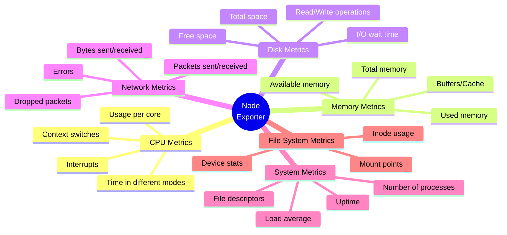

### How Node Exporter Works

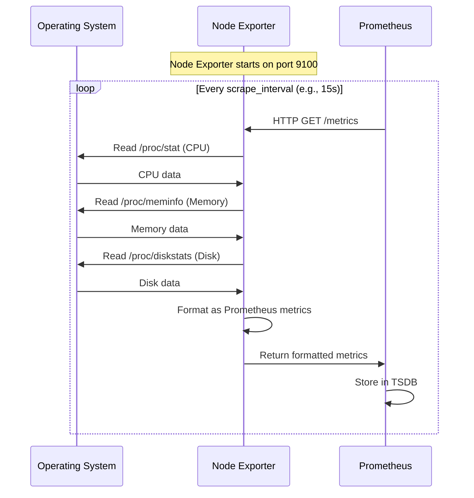

### Sample Node Exporter Output

When you visit `http://localhost:9100/metrics`, you see:

```
# HELP node_cpu_seconds_total Seconds the CPUs spent in each mode.
# TYPE node_cpu_seconds_total counter
node_cpu_seconds_total{cpu="0",mode="idle"} 123456.78
node_cpu_seconds_total{cpu="0",mode="system"} 2345.67
node_cpu_seconds_total{cpu="0",mode="user"} 5678.90

# HELP node_memory_MemTotal_bytes Memory information field MemTotal_bytes.
# TYPE node_memory_MemTotal_bytes gauge
node_memory_MemTotal_bytes 16777216000

# HELP node_memory_MemAvailable_bytes Memory information field MemAvailable_bytes.
# TYPE node_memory_MemAvailable_bytes gauge
node_memory_MemAvailable_bytes 8388608000

# HELP node_filesystem_avail_bytes Filesystem space available to non-root users in bytes.
# TYPE node_filesystem_avail_bytes gauge
node_filesystem_avail_bytes{device="/dev/sda1",fstype="ext4",mountpoint="/"} 214748364800

# HELP node_network_receive_bytes_total Network device statistic receive_bytes.
# TYPE node_network_receive_bytes_total counter
node_network_receive_bytes_total{device="eth0"} 12345678901

# HELP node_load1 1m load average.
# TYPE node_load1 gauge
node_load1 1.52
```

### Understanding the Format

Each metric line has:
1. **Metric name**: `node_cpu_seconds_total`
2. **Labels** (in curly braces): `{cpu="0",mode="idle"}`
3. **Value**: `123456.78`
4. **Optional timestamp**: (usually omitted, Prometheus adds it)

---

## 🎨 Grafana: Visualization Platform

### What is Grafana?

**Simple Definition:**
Grafana is a web-based tool that creates beautiful, interactive dashboards to visualize your metrics.

**Real-Life Analogy:**
Prometheus is like a spreadsheet full of numbers. Grafana transforms those numbers into beautiful charts and graphs - like creating a colorful infographic from boring data.

### Why Do We Need Grafana?

Imagine trying to understand your server's health by reading raw numbers:
```
cpu_usage{instance="server1"} 45.2 1701436800
cpu_usage{instance="server1"} 47.3 1701436815
cpu_usage{instance="server1"} 52.1 1701436830
...thousands more lines...
```

VS. Looking at a beautiful line chart:
```
📈 CPU Usage Over Time
|                                    *--*
|                               *--*     
|                          *--*           
|                     *--*               
|________________*--*____________________
  10:00   10:05   10:10   10:15   10:20
```

### Grafana Features

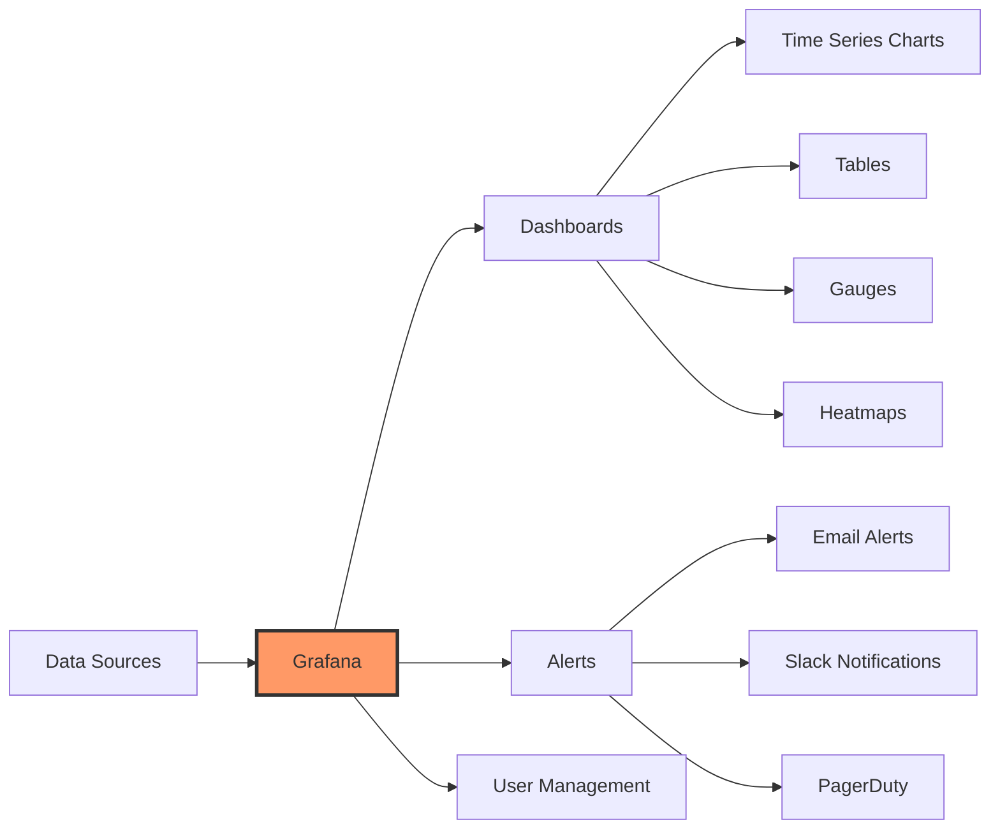

### Dashboard Components

#### 1. Panels
Individual visualizations (charts, graphs, tables)

**Panel Types:**
- **Time Series**: Line charts showing data over time
- **Gauge**: Shows current value like a speedometer
- **Stat**: Big number with optional sparkline
- **Bar Chart**: Compare values side by side
- **Table**: Raw data in tabular format
- **Heatmap**: Color-coded data density

#### 2. Variables
Dynamic values that change dashboard behavior

**Example:**
```
Server: [Dropdown: server1, server2, server3]
Time Range: [Dropdown: Last 1h, Last 6h, Last 24h]
```

When you select "server2", all panels automatically show data for server2.

#### 3. Annotations
Mark important events on your charts

**Examples:**
- Deployment times
- Maintenance windows
- Incidents

### Grafana Architecture

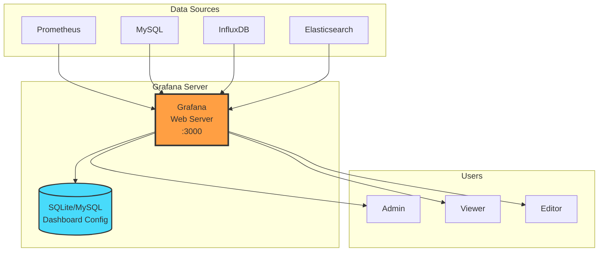

---

## 🛠️ Installation Guide

### Prerequisites

Before starting, ensure you have:
- A Linux server (Ubuntu 20.04/22.04 or similar)
- Root or sudo access
- Internet connection
- Basic command-line knowledge

### System Requirements

**Minimum:**
- 2 CPU cores
- 4GB RAM
- 20GB disk space

**Recommended:**
- 4+ CPU cores
- 8GB+ RAM
- 50GB+ SSD disk space

### Architecture Overview

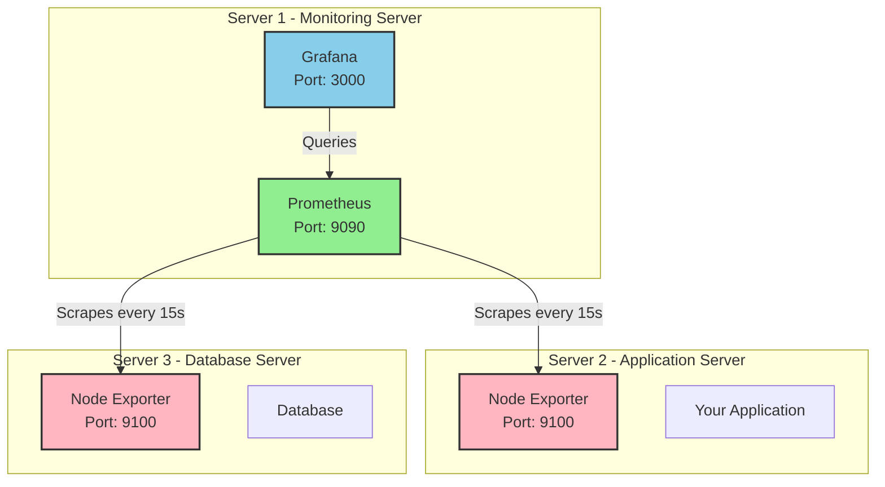

---

## 📦 Step-by-Step Installation

### Part 1: Installing Prometheus

#### Step 1: Create Prometheus User

```bash
# Create a system user for Prometheus (no home directory, no login shell)
sudo useradd --no-create-home --shell /bin/false prometheus

# Verify user creation
id prometheus
# Output: uid=998(prometheus) gid=998(prometheus) groups=998(prometheus)
```

**Why?** Running Prometheus as a dedicated user improves security. If compromised, the attacker has limited access.

#### Step 2: Create Directories

```bash
# Create configuration directory
sudo mkdir -p /etc/prometheus

# Create data storage directory
sudo mkdir -p /var/lib/prometheus

# Set ownership to prometheus user
sudo chown prometheus:prometheus /etc/prometheus
sudo chown prometheus:prometheus /var/lib/prometheus
```

#### Step 3: Download Prometheus

```bash
# Go to temporary directory
cd /tmp

# Download latest version (check https://prometheus.io/download/ for latest)
wget https://github.com/prometheus/prometheus/releases/download/v2.48.0/prometheus-2.48.0.linux-amd64.tar.gz

# Extract
tar -xvf prometheus-2.48.0.linux-amd64.tar.gz

# Navigate to extracted directory
cd prometheus-2.48.0.linux-amd64
```

#### Step 4: Install Prometheus Binaries

```bash
# Copy binaries to /usr/local/bin
sudo cp prometheus /usr/local/bin/
sudo cp promtool /usr/local/bin/

# Set ownership
sudo chown prometheus:prometheus /usr/local/bin/prometheus
sudo chown prometheus:prometheus /usr/local/bin/promtool

# Copy console files
sudo cp -r consoles /etc/prometheus
sudo cp -r console_libraries /etc/prometheus

# Set ownership
sudo chown -R prometheus:prometheus /etc/prometheus/consoles
sudo chown -R prometheus:prometheus /etc/prometheus/console_libraries
```

#### Step 5: Create Prometheus Configuration

```bash
# Create configuration file
sudo nano /etc/prometheus/prometheus.yml
```

Add the following configuration:

```yaml
# Global configuration
global:
  scrape_interval: 15s       # How often to scrape targets
  evaluation_interval: 15s   # How often to evaluate rules

# Alertmanager configuration
alerting:
  alertmanagers:
    - static_configs:
        - targets:
          # - 'localhost:9093'  # Uncomment when you set up Alertmanager

# Rule files
rule_files:
  # - "alerts.yml"  # Add your alert rules here

# Scrape configurations
scrape_configs:
  # Prometheus itself
  - job_name: 'prometheus'
    static_configs:
      - targets: ['localhost:9090']
        labels:
          alias: 'prometheus-server'

  # Node Exporter (will be added later)
  # - job_name: 'node-exporter'
  #   static_configs:
  #     - targets: ['localhost:9100']
  #       labels:
  #         alias: 'local-server'
```

**Save and exit:** Press `Ctrl+X`, then `Y`, then `Enter`

#### Step 6: Set Permissions

```bash
# Set ownership of the config file
sudo chown prometheus:prometheus /etc/prometheus/prometheus.yml
```

#### Step 7: Create Systemd Service

```bash
# Create service file
sudo nano /etc/systemd/system/prometheus.service
```

Add the following:

```ini
[Unit]
Description=Prometheus
Documentation=https://prometheus.io/docs/introduction/overview/
Wants=network-online.target
After=network-online.target

[Service]
Type=simple
User=prometheus
Group=prometheus
ExecReload=/bin/kill -HUP \$MAINPID
ExecStart=/usr/local/bin/prometheus \
  --config.file=/etc/prometheus/prometheus.yml \
  --storage.tsdb.path=/var/lib/prometheus \
  --web.console.templates=/etc/prometheus/consoles \
  --web.console.libraries=/etc/prometheus/console_libraries \
  --web.listen-address=0.0.0.0:9090 \
  --web.enable-lifecycle

SyslogIdentifier=prometheus
Restart=always
RestartSec=5

[Install]
WantedBy=multi-user.target
```

**Save and exit:** `Ctrl+X` → `Y` → `Enter`

#### Step 8: Start Prometheus

```bash
# Reload systemd
sudo systemctl daemon-reload

# Enable Prometheus to start on boot
sudo systemctl enable prometheus

# Start Prometheus
sudo systemctl start prometheus

# Check status
sudo systemctl status prometheus
```

**Expected output:**
```
● prometheus.service - Prometheus
     Loaded: loaded (/etc/systemd/system/prometheus.service; enabled)
     Active: active (running) since Mon 2024-12-01 10:00:00 UTC; 5s ago
```

#### Step 9: Verify Installation

```bash
# Test Prometheus is responding
curl http://localhost:9090/metrics

# You should see metrics output starting with:
# HELP go_gc_duration_seconds A summary of the garbage collection
```

**Access Prometheus UI:**
Open a browser and go to: `http://YOUR_SERVER_IP:9090`

**🎉 Success Indicators:**
- You see the Prometheus web interface
- Status → Targets shows "prometheus" endpoint as UP
- You can execute a query like `up` and see results

---

### Part 2: Installing Node Exporter

Node Exporter should be installed on **every server you want to monitor** (including the Prometheus server itself).

#### Step 1: Create Node Exporter User

```bash
# Create system user
sudo useradd --no-create-home --shell /bin/false node_exporter

# Verify
id node_exporter
```

#### Step 2: Download Node Exporter

```bash
# Go to temp directory
cd /tmp

# Download (check https://prometheus.io/download/#node_exporter for latest)
wget https://github.com/prometheus/node_exporter/releases/download/v1.7.0/node_exporter-1.7.0.linux-amd64.tar.gz

# Extract
tar -xvf node_exporter-1.7.0.linux-amd64.tar.gz

# Navigate
cd node_exporter-1.7.0.linux-amd64
```

#### Step 3: Install Binary

```bash
# Copy binary
sudo cp node_exporter /usr/local/bin/

# Set ownership
sudo chown node_exporter:node_exporter /usr/local/bin/node_exporter
```

#### Step 4: Create Systemd Service

```bash
# Create service file
sudo nano /etc/systemd/system/node_exporter.service
```

Add:

```ini
[Unit]
Description=Node Exporter
Documentation=https://prometheus.io/docs/guides/node-exporter/
Wants=network-online.target
After=network-online.target

[Service]
Type=simple
User=node_exporter
Group=node_exporter
ExecStart=/usr/local/bin/node_exporter \
  --collector.systemd \
  --collector.processes

SyslogIdentifier=node_exporter
Restart=always
RestartSec=5

[Install]
WantedBy=multi-user.target
```

**Note:** The `--collector.systemd` and `--collector.processes` flags enable additional metrics.

#### Step 5: Start Node Exporter

```bash
# Reload systemd
sudo systemctl daemon-reload

# Enable service
sudo systemctl enable node_exporter

# Start service
sudo systemctl start node_exporter

# Check status
sudo systemctl status node_exporter
```

#### Step 6: Verify Installation

```bash
# Check if Node Exporter is running
curl http://localhost:9100/metrics | head -20

# You should see output like:
# HELP node_cpu_seconds_total Seconds the CPUs spent in each mode.
# TYPE node_cpu_seconds_total counter
# node_cpu_seconds_total{cpu="0",mode="idle"} 123456.78
```

#### Step 7: Configure Prometheus to Scrape Node Exporter

```bash
# Edit Prometheus config
sudo nano /etc/prometheus/prometheus.yml
```

Uncomment/add the node-exporter job:

```yaml
scrape_configs:
  - job_name: 'prometheus'
    static_configs:
      - targets: ['localhost:9090']

  # Add this section
  - job_name: 'node-exporter'
    static_configs:
      - targets: ['localhost:9100']
        labels:
          alias: 'monitoring-server'
          environment: 'production'
```

**If monitoring multiple servers:**

```yaml
  - job_name: 'node-exporter'
    static_configs:
      - targets: 
        - 'localhost:9100'
        - '192.168.1.101:9100'  # Server 1
        - '192.168.1.102:9100'  # Server 2
        labels:
          environment: 'production'
      - targets:
        - '192.168.1.201:9100'  # Test Server
        labels:
          environment: 'testing'
```

#### Step 8: Reload Prometheus

```bash
# Reload Prometheus configuration
sudo systemctl reload prometheus

# Or if that doesn't work:
sudo systemctl restart prometheus

# Check status
sudo systemctl status prometheus
```

#### Step 9: Verify in Prometheus UI

1. Open browser: `http://YOUR_SERVER_IP:9090`
2. Go to: **Status** → **Targets**
3. You should see:
   - `prometheus` (UP)
   - `node-exporter` (UP)

**Try a query:**
- In the query box, type: `node_cpu_seconds_total`
- Click **Execute**
- You should see CPU metrics!

---

### Part 3: Installing Grafana

#### Step 1: Add Grafana Repository

```bash
# Add GPG key
sudo mkdir -p /etc/apt/keyrings/
wget -q -O - https://packages.grafana.com/gpg.key | gpg --dearmor | sudo tee /etc/apt/trusted.gpg.d/grafana.gpg > /dev/null

# Add repository
echo 'deb [signed-by=/etc/apt/trusted.gpg.d/grafana.gpg] https://packages.grafana.com/oss/deb stable main' | sudo tee /etc/apt/sources.list.d/grafana.list

# Update package list
sudo apt update
```

#### Step 2: Install Grafana

```bash
# Install Grafana
sudo apt install grafana -y
```

#### Step 3: Start Grafana

```bash
# Enable Grafana to start on boot
sudo systemctl enable grafana-server

# Start Grafana
sudo systemctl start grafana-server

# Check status
sudo systemctl status grafana-server
```

#### Step 4: Access Grafana

**Open browser:** `http://YOUR_SERVER_IP:3000`

**Default credentials:**
- Username: `admin`
- Password: `admin`

**You'll be prompted to change the password** - choose a strong password!

#### Step 5: Add Prometheus as Data Source

1. **Click** the gear icon (⚙️) on the left sidebar
2. **Click** "Data Sources"
3. **Click** "Add data source"
4. **Select** "Prometheus"

**Configure:**
- **Name**: `Prometheus`
- **URL**: `http://localhost:9090` (or `http://YOUR_PROMETHEUS_IP:9090` if separate servers)
- **Access**: `Server (default)`

**Scroll down and click** "Save & Test"

**✅ Success message:** "Successfully queried the Prometheus API."

#### Step 6: Import Node Exporter Dashboard

1. **Click** the "+" icon on the left sidebar
2. **Click** "Import"
3. **Enter dashboard ID**: `1860` (Node Exporter Full)
4. **Click** "Load"
5. **Select Prometheus data source**: Choose "Prometheus"
6. **Click** "Import"

**🎉 You now have a beautiful dashboard showing:**
- CPU usage
- Memory usage
- Disk usage
- Network traffic
- System load
- And much more!

---

## 🔒 Security Configuration

### Restricting Access with Security Groups (AWS EC2)

If you're running on AWS EC2, use Security Groups to restrict access.

#### Security Group Configuration

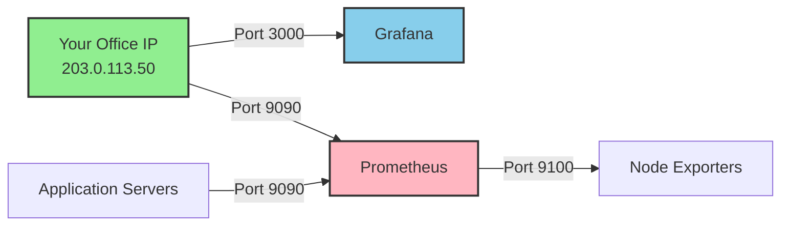

#### Inbound Rules for Monitoring Server

**For Grafana (Port 3000):**
```
Type: Custom TCP
Port: 3000
Source: YOUR_OFFICE_IP/32
Description: Grafana UI access from office
```

**For Prometheus (Port 9090):**
```
Type: Custom TCP
Port: 9090
Source: YOUR_OFFICE_IP/32
Description: Prometheus UI access from office (optional)
```

**For Node Exporter scraping (Port 9100):**
```
Type: Custom TCP
Port: 9100
Source: PROMETHEUS_SERVER_IP/32
Description: Allow Prometheus to scrape Node Exporter
```

**SSH Access:**
```
Type: SSH
Port: 22
Source: YOUR_OFFICE_IP/32
Description: SSH access from office
```

#### Inbound Rules for Application Servers

**Only Node Exporter (Port 9100):**
```
Type: Custom TCP
Port: 9100
Source: PROMETHEUS_SERVER_IP/32
Description: Allow Prometheus to scrape metrics
```

**SSH Access:**
```
Type: SSH
Port: 22
Source: YOUR_OFFICE_IP/32
Description: SSH access from office
```

### Using UFW Firewall (Ubuntu)

If you're not using AWS or want additional security:

#### On Monitoring Server

```bash
# Enable UFW
sudo ufw enable

# Allow SSH (be careful!)
sudo ufw allow from YOUR_OFFICE_IP to any port 22

# Allow Grafana from specific IP
sudo ufw allow from YOUR_OFFICE_IP to any port 3000

# Allow Prometheus from specific IP (optional)
sudo ufw allow from YOUR_OFFICE_IP to any port 9090

# Check status
sudo ufw status numbered
```

#### On Application Servers

```bash
# Enable UFW
sudo ufw enable

# Allow SSH
sudo ufw allow from YOUR_OFFICE_IP to any port 22

# Allow Node Exporter from Prometheus server
sudo ufw allow from PROMETHEUS_SERVER_IP to any port 9100

# Check status
sudo ufw status numbered
```

### Setting Up Nginx Reverse Proxy with SSL

For production, use Nginx with SSL to secure Grafana.

#### Step 1: Install Nginx and Certbot

```bash
# Install Nginx
sudo apt-get update
sudo apt-get install nginx -y

# Install Certbot
sudo apt-get install certbot python3-certbot-nginx -y
```

#### Step 2: Configure Nginx

```bash
# Create Nginx configuration
sudo nano /etc/nginx/sites-available/grafana
```

Add:

```nginx
server {
    listen 80;
    server_name grafana.yourdomain.com;
    
    # Redirect to HTTPS
    return 301 https://$server_name$request_uri;
}

server {
    listen 443 ssl http2;
    server_name grafana.yourdomain.com;
    
    # SSL certificates (will be added by Certbot)
    # ssl_certificate /etc/letsencrypt/live/grafana.yourdomain.com/fullchain.pem;
    # ssl_certificate_key /etc/letsencrypt/live/grafana.yourdomain.com/privkey.pem;
    
    location / {
        proxy_pass http://localhost:3000;
        proxy_set_header Host $host;
        proxy_set_header X-Real-IP $remote_addr;
        proxy_set_header X-Forwarded-For $proxy_add_x_forwarded_for;
        proxy_set_header X-Forwarded-Proto $scheme;
    }
}
```

#### Step 3: Enable Configuration

```bash
# Create symbolic link
sudo ln -s /etc/nginx/sites-available/grafana /etc/nginx/sites-enabled/

# Test configuration
sudo nginx -t

# If OK, restart Nginx
sudo systemctl restart nginx
```

#### Step 4: Get SSL Certificate

```bash
# Get certificate
sudo certbot --nginx -d grafana.yourdomain.com

# Follow prompts and agree to terms
```

**Certbot will automatically:**
- Obtain certificate
- Configure Nginx
- Set up auto-renewal

#### Step 5: Update Grafana Configuration

```bash
# Edit Grafana config
sudo nano /etc/grafana/grafana.ini
```

Find and update:

```ini
[server]
domain = grafana.yourdomain.com
root_url = https://grafana.yourdomain.com
```

Restart Grafana:

```bash
sudo systemctl restart grafana-server
```

**Now access:** `https://grafana.yourdomain.com`

---

## 🔧 Working Examples

### Example 1: Basic Monitoring Setup (Single Server)

This is the simplest setup - everything on one server.

**Architecture:**
```
┌─────────────────────────────────┐
│   Single Server (Monitoring)    │
├─────────────────────────────────┤
│  • Prometheus     (:9090)       │
│  • Node Exporter  (:9100)       │
│  • Grafana        (:3000)       │
└─────────────────────────────────┘
```

**Configuration already done!** If you followed the installation guide, this is what you have.

**Test it:**

1. **Check all services:**
```bash
sudo systemctl status prometheus
sudo systemctl status node_exporter
sudo systemctl status grafana-server
```

2. **Access Prometheus:** `http://YOUR_IP:9090`
   - Run query: `up` (should show 2 targets UP)

3. **Access Grafana:** `http://YOUR_IP:3000`
   - View Node Exporter Full dashboard

### Example 2: Multi-Server Monitoring

Monitor multiple application servers from a central monitoring server.

**Architecture:**
```
┌──────────────────────┐
│  Monitoring Server   │
├──────────────────────┤
│  • Prometheus :9090  │
│  • Grafana    :3000  │
└──────────┬───────────┘
           │ Scrapes metrics
           ├──────────┬──────────┬──────────
           │          │          │
    ┌──────▼────┐ ┌──▼──────┐ ┌─▼────────┐
    │  Server 1 │ │ Server 2│ │ Server 3 │
    │  Node Exp.│ │ Node Exp│ │ Node Exp │
    │  :9100    │ │ :9100   │ │ :9100    │
    └───────────┘ └─────────┘ └──────────┘
```

#### On Each Application Server (Server 1, 2, 3):

**Install Node Exporter:**

```bash
# SSH to each server and run:
cd /tmp
wget https://github.com/prometheus/node_exporter/releases/download/v1.7.0/node_exporter-1.7.0.linux-amd64.tar.gz
tar -xvf node_exporter-1.7.0.linux-amd64.tar.gz
sudo cp node_exporter-1.7.0.linux-amd64/node_exporter /usr/local/bin/
sudo useradd --no-create-home --shell /bin/false node_exporter
sudo chown node_exporter:node_exporter /usr/local/bin/node_exporter

# Create service
cat << EOF | sudo tee /etc/systemd/system/node_exporter.service
[Unit]
Description=Node Exporter
Wants=network-online.target
After=network-online.target

[Service]
User=node_exporter
Group=node_exporter
Type=simple
ExecStart=/usr/local/bin/node_exporter --collector.systemd --collector.processes

[Install]
WantedBy=multi-user.target
EOF

# Start service
sudo systemctl daemon-reload
sudo systemctl enable node_exporter
sudo systemctl start node_exporter
sudo systemctl status node_exporter
```

#### On Monitoring Server:

**Update Prometheus configuration:**

```bash
sudo nano /etc/prometheus/prometheus.yml
```

Add all servers:

```yaml
scrape_configs:
  - job_name: 'prometheus'
    static_configs:
      - targets: ['localhost:9090']

  - job_name: 'node-exporter'
    static_configs:
      # Monitoring server itself
      - targets: ['localhost:9100']
        labels:
          alias: 'monitoring-server'
          role: 'monitoring'
          environment: 'production'
      
      # Application Server 1
      - targets: ['192.168.1.101:9100']
        labels:
          alias: 'app-server-1'
          role: 'application'
          environment: 'production'
      
      # Application Server 2
      - targets: ['192.168.1.102:9100']
        labels:
          alias: 'app-server-2'
          role: 'application'
          environment: 'production'
      
      # Database Server
      - targets: ['192.168.1.103:9100']
        labels:
          alias: 'db-server-1'
          role: 'database'
          environment: 'production'
```

**Reload Prometheus:**

```bash
sudo systemctl reload prometheus
```

**Verify in Prometheus:**
- Go to: Status → Targets
- You should see all servers listed as UP

### Example 3: Custom Application Metrics

Let's create a simple Python application that exposes custom metrics.

**Use Case:** Monitor a web application's request count and processing time.

#### Step 1: Create Python Application

```bash
# Install required library
pip3 install prometheus_client flask
```

**Create application file:**

```bash
nano /tmp/app_with_metrics.py
```

Add:

```python
#!/usr/bin/env python3
"""
Simple Flask application with Prometheus metrics
"""

from flask import Flask, request, Response
from prometheus_client import Counter, Histogram, generate_latest, REGISTRY, CONTENT_TYPE_LATEST
import time
import random

# Create Flask app
app = Flask(__name__)

# Define metrics
REQUEST_COUNT = Counter(
    'app_requests_total',
    'Total number of requests',
    ['method', 'endpoint', 'status']
)

REQUEST_DURATION = Histogram(
    'app_request_duration_seconds',
    'Time spent processing request',
    ['endpoint']
)

ACTIVE_USERS = Counter(
    'app_active_users_total',
    'Total number of active users'
)

# Application routes
@app.route('/')
def home():
    start_time = time.time()
    
    # Simulate some work
    time.sleep(random.uniform(0.1, 0.5))
    
    # Record metrics
    REQUEST_COUNT.labels(method='GET', endpoint='/', status=200).inc()
    REQUEST_DURATION.labels(endpoint='/').observe(time.time() - start_time)
    
    return "Hello! This is a monitored application."

@app.route('/api/users')
def users():
    start_time = time.time()
    
    # Simulate database query
    time.sleep(random.uniform(0.2, 0.8))
    
    # Record metrics
    REQUEST_COUNT.labels(method='GET', endpoint='/api/users', status=200).inc()
    REQUEST_DURATION.labels(endpoint='/api/users').observe(time.time() - start_time)
    ACTIVE_USERS.inc()
    
    return {"users": ["Alice", "Bob", "Charlie"]}

@app.route('/api/error')
def error():
    # Simulate error
    REQUEST_COUNT.labels(method='GET', endpoint='/api/error', status=500).inc()
    return "Error occurred", 500

# Metrics endpoint for Prometheus - FIXED
@app.route('/metrics')
def metrics():
    return Response(generate_latest(REGISTRY), mimetype=CONTENT_TYPE_LATEST)

if __name__ == '__main__':
    print("Starting application on http://0.0.0.0:8080")
    print("Metrics available at http://0.0.0.0:8080/metrics")
    app.run(host='0.0.0.0', port=8080)
```

**Make it executable:**

```bash
chmod +x /tmp/app_with_metrics.py
```

#### Step 2: Run the Application

```bash
# Run in background
nohup python3 /tmp/app_with_metrics.py > /tmp/app.log 2>&1 &

# Check it's running
curl http://localhost:8080/
curl http://localhost:8080/metrics
```

#### Step 3: Generate Some Traffic

```bash
# Create a simple load generator
cat << 'EOF' > /tmp/generate_traffic.sh
#!/bin/bash
while true; do
    curl -s http://localhost:8080/ > /dev/null
    curl -s http://localhost:8080/api/users > /dev/null
    
    # Occasionally hit error endpoint
    if [ $((RANDOM % 10)) -eq 0 ]; then
        curl -s http://localhost:8080/api/error > /dev/null
    fi
    
    sleep 1
done
EOF

chmod +x /tmp/generate_traffic.sh

# Run in background
nohup /tmp/generate_traffic.sh > /dev/null 2>&1 &
```

#### Step 4: Configure Prometheus

```bash
sudo nano /etc/prometheus/prometheus.yml
```

Add:

```yaml
scrape_configs:
  # ... existing configs ...
  
  - job_name: 'python-app'
    static_configs:
      - targets: ['localhost:8080']
        labels:
          application: 'demo-app'
          environment: 'development'
```

**Reload Prometheus:**

```bash
sudo systemctl reload prometheus
```

#### Step 5: Create Grafana Dashboard

1. **Login to Grafana**
2. **Create new dashboard**: Click "+" → "Dashboard"
3. **Add panel**: Click "Add panel"

**Panel 1: Request Rate**

- **Query:**
  ```promql
  rate(app_requests_total[5m])
  ```
- **Legend:** `{{method}} {{endpoint}} - {{status}}`
- **Panel title:** "Request Rate (req/sec)"

**Panel 2: Request Duration**

- **Query:**
  ```promql
  histogram_quantile(0.95, rate(app_request_duration_seconds_bucket[5m]))
  ```
- **Legend:** `{{endpoint}} - p95`
- **Panel title:** "95th Percentile Response Time"

**Panel 3: Total Requests by Status**

- **Query:**
  ```promql
  sum by (status) (app_requests_total)
  ```
- **Visualization:** Pie chart
- **Panel title:** "Requests by Status Code"

**Panel 4: Active Users**

- **Query:**
  ```promql
  app_active_users_total
  ```
- **Visualization:** Stat
- **Panel title:** "Total Active Users"

### Example 4: Alerting Configuration

Set up alerts to notify you when things go wrong.

#### Step 1: Create Alert Rules

```bash
# Create alert rules file
sudo nano /etc/prometheus/alerts.yml
```

Add:

```yaml
groups:
  - name: system_alerts
    interval: 30s
    rules:
      # Alert when instance is down
      - alert: InstanceDown
        expr: up == 0
        for: 5m
        labels:
          severity: critical
          category: availability
        annotations:
          summary: "Instance {{ $labels.instance }} is down"
          description: "{{ $labels.instance }} of job {{ $labels.job }} has been down for more than 5 minutes."

      # Alert when CPU is high
      - alert: HighCPUUsage
        expr: 100 - (avg by(instance) (rate(node_cpu_seconds_total{mode="idle"}[5m])) * 100) > 80
        for: 10m
        labels:
          severity: warning
          category: performance
        annotations:
          summary: "High CPU usage on {{ $labels.instance }}"
          description: "CPU usage is above 80% for more than 10 minutes. Current value: {{ $value }}%"

      # Alert when memory is low
      - alert: LowMemory
        expr: (node_memory_MemAvailable_bytes / node_memory_MemTotal_bytes) * 100 < 10
        for: 5m
        labels:
          severity: warning
          category: resources
        annotations:
          summary: "Low memory on {{ $labels.instance }}"
          description: "Available memory is less than 10%. Current: {{ $value }}%"

      # Alert when disk space is low
      - alert: LowDiskSpace
        expr: (node_filesystem_avail_bytes{mountpoint="/"} / node_filesystem_size_bytes{mountpoint="/"}) * 100 < 15
        for: 5m
        labels:
          severity: warning
          category: storage
        annotations:
          summary: "Low disk space on {{ $labels.instance }}"
          description: "Disk space on root partition is less than 15%. Current: {{ $value }}%"

      # Alert for high error rate in application
      - alert: HighErrorRate
        expr: rate(app_requests_total{status=~"5.."}[5m]) > 0.05
        for: 5m
        labels:
          severity: critical
          category: application
        annotations:
          summary: "High error rate in application"
          description: "Error rate is above 5%. Current: {{ $value }} errors/sec"
```

#### Step 2: Update Prometheus Configuration

```bash
sudo nano /etc/prometheus/prometheus.yml
```

Add the rule file:

```yaml
# Add this section
rule_files:
  - 'alerts.yml'
```

**Reload Prometheus:**

```bash
# Copy alerts file
sudo chown prometheus:prometheus /etc/prometheus/alerts.yml

# Reload
sudo systemctl reload prometheus
```

#### Step 3: Verify Alerts

1. **Open Prometheus UI:** `http://YOUR_IP:9090`
2. **Go to:** Alerts
3. **You should see** all defined alerts

#### Step 4: Configure Grafana Alerts

**In Grafana:**

1. **Go to a panel** (e.g., CPU Usage)
2. **Click** the panel title → "Edit"
3. **Click** "Alert" tab
4. **Click** "Create alert rule"

**Configure alert:**

- **Condition:** `avg() OF query(A, 5m, now) IS ABOVE 80`
- **Evaluate:** Every 1m for 5m
- **Name:** High CPU Usage

**Contact Point:**

5. **Go to:** Alerting → Contact points
6. **Click** "New contact point"
7. **Choose** Email, Slack, or other integration
8. **Configure** credentials

**Example Email Configuration:**

```
Name: Email Alerts
Type: Email
Addresses: admin@example.com, ops@example.com
```

**Example Slack Configuration:**

```
Name: Slack Alerts
Type: Slack
Webhook URL: https://hooks.slack.com/services/YOUR/WEBHOOK/URL
```

---

## 📊 Advanced Configuration

### Custom Recording Rules

Recording rules pre-compute frequently used queries to improve dashboard performance.

```bash
# Create recording rules file
sudo nano /etc/prometheus/recording_rules.yml
```

Add:

```yaml
groups:
  - name: node_recording_rules
    interval: 30s
    rules:
      # CPU usage percentage
      - record: instance:node_cpu_utilisation:rate5m
        expr: 100 - (avg by (instance) (rate(node_cpu_seconds_total{mode="idle"}[5m])) * 100)

      # Memory usage percentage
      - record: instance:node_memory_utilisation:ratio
        expr: (node_memory_MemTotal_bytes - node_memory_MemAvailable_bytes) / node_memory_MemTotal_bytes * 100

      # Disk usage percentage
      - record: instance:node_disk_utilisation:ratio
        expr: (node_filesystem_size_bytes{mountpoint="/"} - node_filesystem_avail_bytes{mountpoint="/"}) / node_filesystem_size_bytes{mountpoint="/"} * 100

      # Network traffic rate
      - record: instance:node_network_receive_bytes:rate5m
        expr: rate(node_network_receive_bytes_total{device!="lo"}[5m])

      - record: instance:node_network_transmit_bytes:rate5m
        expr: rate(node_network_transmit_bytes_total{device!="lo"}[5m])
```

Update prometheus.yml:

```yaml
rule_files:
  - 'alerts.yml'
  - 'recording_rules.yml'
```

**Reload:**

```bash
sudo chown prometheus:prometheus /etc/prometheus/recording_rules.yml
sudo systemctl reload prometheus
```

**Now use in queries:**

Instead of:
```promql
100 - (avg by (instance) (rate(node_cpu_seconds_total{mode="idle"}[5m])) * 100)
```

Use:
```promql
instance:node_cpu_utilisation:rate5m
```

Much faster!

### Long-Term Storage Configuration

By default, Prometheus keeps data for 15 days. To keep longer:

```bash
sudo nano /etc/systemd/system/prometheus.service
```

Modify `ExecStart`:

```ini
ExecStart=/usr/local/bin/prometheus \
  --config.file=/etc/prometheus/prometheus.yml \
  --storage.tsdb.path=/var/lib/prometheus \
  --storage.tsdb.retention.time=90d \
  --storage.tsdb.retention.size=50GB \
  --web.console.templates=/etc/prometheus/consoles \
  --web.console.libraries=/etc/prometheus/console_libraries \
  --web.listen-address=0.0.0.0:9090 \
  --web.enable-lifecycle
```

**Options:**
- `--storage.tsdb.retention.time=90d`: Keep 90 days of data
- `--storage.tsdb.retention.size=50GB`: Or until 50GB is used

**Reload:**

```bash
sudo systemctl daemon-reload
sudo systemctl restart prometheus
```

### Service Discovery (Dynamic Targets)

Instead of manually listing targets, use service discovery.

#### File-Based Service Discovery

**Create targets file:**

```bash
sudo nano /etc/prometheus/targets/nodes.json
```

Add:

```json
[
  {
    "targets": ["192.168.1.101:9100", "192.168.1.102:9100"],
    "labels": {
      "environment": "production",
      "role": "application"
    }
  },
  {
    "targets": ["192.168.1.201:9100"],
    "labels": {
      "environment": "staging",
      "role": "application"
    }
  }
]
```

**Update prometheus.yml:**

```yaml
scrape_configs:
  - job_name: 'node-exporter'
    file_sd_configs:
      - files:
        - '/etc/prometheus/targets/*.json'
        refresh_interval: 30s
```

**Set permissions:**

```bash
sudo mkdir -p /etc/prometheus/targets
sudo chown -R prometheus:prometheus /etc/prometheus/targets
sudo systemctl reload prometheus
```

**Benefits:**
- Add/remove targets by editing JSON file
- No need to reload Prometheus
- Can automate with scripts

---

## 🔗 Monitoring Other Tools

### MySQL Database Monitoring

#### Step 1: Install MySQL Exporter

```bash
cd /tmp
wget https://github.com/prometheus/mysqld_exporter/releases/download/v0.15.1/mysqld_exporter-0.15.1.linux-amd64.tar.gz
tar -xvf mysqld_exporter-0.15.1.linux-amd64.tar.gz
sudo cp mysqld_exporter-0.15.1.linux-amd64/mysqld_exporter /usr/local/bin/
sudo useradd --no-create-home --shell /bin/false mysqld_exporter
sudo chown mysqld_exporter:mysqld_exporter /usr/local/bin/mysqld_exporter
```

#### Step 2: Create MySQL User

```sql
-- Login to MySQL
mysql -u root -p

-- Create monitoring user
CREATE USER 'exporter'@'localhost' IDENTIFIED BY 'STRONG_PASSWORD' WITH MAX_USER_CONNECTIONS 3;
GRANT PROCESS, REPLICATION CLIENT, SELECT ON *.* TO 'exporter'@'localhost';
FLUSH PRIVILEGES;
```

#### Step 3: Configure MySQL Exporter

```bash
# Create config file
sudo nano /etc/.mysqld_exporter.cnf
```

Add:

```ini
[client]
user=exporter
password=STRONG_PASSWORD
```

**Set permissions:**

```bash
sudo chown mysqld_exporter:mysqld_exporter /etc/.mysqld_exporter.cnf
sudo chmod 600 /etc/.mysqld_exporter.cnf
```

#### Step 4: Create Service

```bash
sudo nano /etc/systemd/system/mysqld_exporter.service
```

Add:

```ini
[Unit]
Description=MySQL Exporter
After=network.target

[Service]
Type=simple
User=mysqld_exporter
Group=mysqld_exporter
ExecStart=/usr/local/bin/mysqld_exporter \
  --config.my-cnf=/etc/.mysqld_exporter.cnf \
  --collect.global_status \
  --collect.info_schema.innodb_metrics \
  --collect.auto_increment.columns \
  --collect.info_schema.processlist \
  --collect.binlog_size \
  --collect.info_schema.tablestats \
  --collect.global_variables \
  --collect.info_schema.query_response_time \
  --collect.info_schema.userstats \
  --collect.info_schema.tables \
  --collect.perf_schema.tablelocks \
  --collect.perf_schema.file_events \
  --collect.perf_schema.eventswaits \
  --collect.perf_schema.indexiowaits \
  --collect.perf_schema.tableiowaits \
  --collect.slave_status \
  --web.listen-address=0.0.0.0:9104

[Install]
WantedBy=multi-user.target
```

#### Step 5: Start Service

```bash
sudo systemctl daemon-reload
sudo systemctl enable mysqld_exporter
sudo systemctl start mysqld_exporter
sudo systemctl status mysqld_exporter
```

#### Step 6: Add to Prometheus

```yaml
scrape_configs:
  - job_name: 'mysql'
    static_configs:
      - targets: ['localhost:9104']
        labels:
          database: 'mysql-prod'
```

**Reload Prometheus and import dashboard 7362 in Grafana!**

### Docker Container Monitoring

#### Using cAdvisor

```bash
# Run cAdvisor
docker run -d \
  --name=cadvisor \
  --restart=always \
  --volume=/:/rootfs:ro \
  --volume=/var/run:/var/run:ro \
  --volume=/sys:/sys:ro \
  --volume=/var/lib/docker/:/var/lib/docker:ro \
  --volume=/dev/disk/:/dev/disk:ro \
  --publish=8080:8080 \
  --detach=true \
  gcr.io/cadvisor/cadvisor:latest
```

**Add to Prometheus:**

```yaml
scrape_configs:
  - job_name: 'cadvisor'
    static_configs:
      - targets: ['localhost:8080']
```

**Import Grafana dashboard 893!**

### Nginx Monitoring

#### Step 1: Enable Nginx Stub Status

```bash
sudo nano /etc/nginx/sites-available/default
```

Add:

```nginx
server {
    # ... existing config ...
    
    location /nginx_status {
        stub_status on;
        access_log off;
        allow 127.0.0.1;  # Only allow localhost
        deny all;
    }
}
```

**Reload Nginx:**

```bash
sudo nginx -t
sudo systemctl reload nginx
```

#### Step 2: Install Nginx Exporter

```bash
cd /tmp
wget https://github.com/nginxinc/nginx-prometheus-exporter/releases/download/v0.11.0/nginx-prometheus-exporter_0.11.0_linux_amd64.tar.gz
tar -xvf nginx-prometheus-exporter_0.11.0_linux_amd64.tar.gz
sudo cp nginx-prometheus-exporter /usr/local/bin/
```

#### Step 3: Create Service

```bash
sudo nano /etc/systemd/system/nginx_exporter.service
```

Add:

```ini
[Unit]
Description=Nginx Exporter
After=network.target

[Service]
Type=simple
ExecStart=/usr/local/bin/nginx-prometheus-exporter \
  -nginx.scrape-uri=http://localhost/nginx_status

[Install]
WantedBy=multi-user.target
```

**Start:**

```bash
sudo systemctl daemon-reload
sudo systemctl enable nginx_exporter
sudo systemctl start nginx_exporter
```

**Add to Prometheus and import dashboard 12708!**

---

## 🐛 Troubleshooting

### Common Issues and Solutions

#### Issue 1: Prometheus Not Starting

**Symptoms:**
```bash
sudo systemctl status prometheus
# Shows: Failed to start prometheus.service
```

**Solution:**

```bash
# Check logs
sudo journalctl -u prometheus -n 50

# Common causes:
# 1. Configuration syntax error
sudo promtool check config /etc/prometheus/prometheus.yml

# 2. Permission issues
sudo chown -R prometheus:prometheus /etc/prometheus
sudo chown -R prometheus:prometheus /var/lib/prometheus

# 3. Port already in use
sudo lsof -i :9090
# Kill the process if needed
```

#### Issue 2: Target Shows as "Down"

**Symptoms:**
- In Prometheus UI, target shows red "DOWN" status

**Solution:**

```bash
# 1. Check if service is running
sudo systemctl status node_exporter

# 2. Test endpoint directly
curl http://localhost:9100/metrics

# 3. Check firewall
sudo ufw status
sudo ufw allow 9100

# 4. Check if Prometheus can reach target
# On Prometheus server:
curl http://TARGET_IP:9100/metrics

# 5. Check Prometheus config
sudo cat /etc/prometheus/prometheus.yml | grep TARGET_IP
```

#### Issue 3: Grafana Shows "No Data"

**Symptoms:**
- Dashboard panels show "No data"

**Solution:**

```bash
# 1. Verify data source connection
# In Grafana: Configuration → Data Sources → Prometheus → Test

# 2. Check if Prometheus has data
# Run query in Prometheus UI: up

# 3. Verify time range in Grafana
# Click clock icon, ensure it's "Last 5 minutes"

# 4. Check query syntax
# Edit panel, check Query tab for errors

# 5. Verify metrics exist
# In Prometheus: Graph → Execute query manually
```

#### Issue 4: High Memory Usage

**Symptoms:**
- Prometheus consuming too much memory

**Solution:**

```bash
# 1. Check current usage
free -h
ps aux | grep prometheus

# 2. Reduce retention time
sudo nano /etc/systemd/system/prometheus.service
# Change: --storage.tsdb.retention.time=15d

# 3. Reduce scrape frequency
sudo nano /etc/prometheus/prometheus.yml
# Change: scrape_interval: 30s

# 4. Drop unwanted metrics
# Add to scrape config:
metric_relabel_configs:
  - source_labels: [__name__]
    regex: 'unwanted_metric.*'
    action: drop

# 5. Restart Prometheus
sudo systemctl daemon-reload
sudo systemctl restart prometheus
```

#### Issue 5: Disk Full

**Symptoms:**
```
Error: write /var/lib/prometheus/...: no space left on device
```

**Solution:**

```bash
# 1. Check disk usage
df -h
du -sh /var/lib/prometheus/*

# 2. Clean old data
# Option A: Delete old data manually
sudo systemctl stop prometheus
sudo rm -rf /var/lib/prometheus/01*
sudo systemctl start prometheus

# Option B: Reduce retention
sudo nano /etc/systemd/system/prometheus.service
# Add: --storage.tsdb.retention.size=10GB

# 3. Move to larger disk
sudo systemctl stop prometheus
sudo rsync -av /var/lib/prometheus/ /new/larger/disk/prometheus/
sudo nano /etc/systemd/system/prometheus.service
# Update: --storage.tsdb.path=/new/larger/disk/prometheus
sudo systemctl start prometheus
```

### Useful Commands

```bash
# Check all monitoring services
sudo systemctl status prometheus node_exporter grafana-server

# View Prometheus logs
sudo journalctl -u prometheus -f

# View Node Exporter logs
sudo journalctl -u node_exporter -f

# View Grafana logs
sudo journalctl -u grafana-server -f
tail -f /var/log/grafana/grafana.log

# Test Prometheus configuration
sudo promtool check config /etc/prometheus/prometheus.yml

# Test alert rules
sudo promtool check rules /etc/prometheus/alerts.yml

# Query Prometheus from command line
curl 'http://localhost:9090/api/v1/query?query=up'

# Reload Prometheus configuration
curl -X POST http://localhost:9090/-/reload

# Check Prometheus targets
curl http://localhost:9090/api/v1/targets | jq

# Check what metrics Node Exporter provides
curl -s http://localhost:9100/metrics | grep "^# HELP"

# Monitor resource usage
watch -n 1 'ps aux | grep -E "prometheus|node_exporter|grafana" | grep -v grep'
```

---

## 📚 Reference Links

### Official Documentation
- **Prometheus:** https://prometheus.io/docs/
- **Node Exporter:** https://prometheus.io/docs/guides/node-exporter/
- **Grafana:** https://grafana.com/docs/grafana/latest/
- **PromQL:** https://prometheus.io/docs/prometheus/latest/querying/basics/

### Grafana Dashboards
- **Dashboard Library:** https://grafana.com/grafana/dashboards/
- **Node Exporter Full (ID: 1860):** https://grafana.com/grafana/dashboards/1860
- **Prometheus Stats (ID: 2):** https://grafana.com/grafana/dashboards/2

### Exporters
- **All Exporters:** https://prometheus.io/docs/instrumenting/exporters/
- **Node Exporter:** https://github.com/prometheus/node_exporter
- **MySQL Exporter:** https://github.com/prometheus/mysqld_exporter
- **Blackbox Exporter:** https://github.com/prometheus/blackbox_exporter

---

## 🎓 Summary

### What You've Learned

1. **Monitoring Fundamentals**
   - Why monitoring is essential
   - Metrics, time series, labels
   - Pull vs push models

2. **Time Series Databases**
   - How Prometheus TSDB works
   - Data compression techniques
   - Storage architecture

3. **Prometheus**
   - Architecture and components
   - Metric types (Counter, Gauge, Histogram, Summary)
   - PromQL query language
   - Configuration and scraping

4. **Node Exporter**
   - System metrics collection
   - Installation and configuration
   - Available collectors

5. **Grafana**
   - Visualization and dashboards
   - Data sources
   - Alerting

6. **Security**
   - Firewall configuration
   - Security groups (AWS)
   - SSL/TLS with Nginx

7. **Advanced Topics**
   - Multi-server monitoring
   - Custom application metrics
   - Alerting rules
   - Recording rules
   - Service discovery

8. **Monitoring Other Services**
   - MySQL
   - Docker
   - Nginx

### Next Steps

1. **Practice:** Set up a test environment and experiment
2. **Explore:** Try different exporters for your tech stack
3. **Customize:** Create custom dashboards for your needs
4. **Automate:** Use Infrastructure as Code (Terraform, Ansible)
5. **Scale:** Learn about Prometheus federation for large deployments
6. **Integrate:** Connect with alert managers and on-call systems

### Key Takeaways

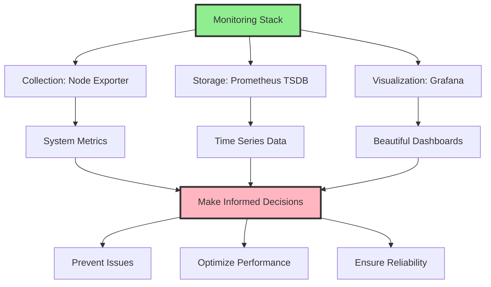

---

## 📋 Quick Reference Card

### Default Ports

| Service | Port | Protocol | Usage |
|---------|------|----------|-------|
| Prometheus | 9090 | HTTP | Web UI & API |
| Node Exporter | 9100 | HTTP | Metrics endpoint |
| Grafana | 3000 | HTTP | Web UI |
| Alertmanager | 9093 | HTTP | Alert management |
| MySQL Exporter | 9104 | HTTP | MySQL metrics |
| cAdvisor | 8080 | HTTP | Container metrics |

### Important Files

| Component | Configuration File | Data Directory |
|-----------|-------------------|----------------|
| Prometheus | /etc/prometheus/prometheus.yml | /var/lib/prometheus |
| Node Exporter | /etc/systemd/system/node_exporter.service | N/A |
| Grafana | /etc/grafana/grafana.ini | /var/lib/grafana |

### Useful PromQL Queries

```promql
# Check if target is up
up

# CPU usage percentage
100 - (avg by (instance) (rate(node_cpu_seconds_total{mode="idle"}[5m])) * 100)

# Memory usage percentage
(1 - (node_memory_MemAvailable_bytes / node_memory_MemTotal_bytes)) * 100

# Disk usage percentage
(1 - (node_filesystem_avail_bytes{mountpoint="/"} / node_filesystem_size_bytes{mountpoint="/"})) * 100

# Network receive rate (bytes/sec)
rate(node_network_receive_bytes_total[5m])

# Load average
node_load1

# Disk I/O operations
rate(node_disk_io_time_seconds_total[5m])
```

### Systemd Commands

```bash
# Start/Stop/Restart
sudo systemctl start|stop|restart prometheus
sudo systemctl start|stop|restart node_exporter
sudo systemctl start|stop|restart grafana-server

# Enable/Disable at boot
sudo systemctl enable|disable prometheus
sudo systemctl enable|disable node_exporter
sudo systemctl enable|disable grafana-server

# Check status
sudo systemctl status prometheus
sudo systemctl status node_exporter
sudo systemctl status grafana-server

# Reload configuration
sudo systemctl reload prometheus
```

---

## 🎉 Congratulations!

You now have a complete understanding of the Prometheus + Node Exporter + Grafana monitoring stack!

**You can:**
- ✅ Install and configure all components
- ✅ Monitor multiple servers
- ✅ Create custom dashboards
- ✅ Set up alerts
- ✅ Secure your monitoring infrastructure
- ✅ Troubleshoot common issues
- ✅ Monitor various services (MySQL, Docker, Nginx)

**Remember:** Monitoring is not a one-time setup. Continuously:
- Review your dashboards
- Tune alert thresholds
- Add new metrics as needed
- Keep components updated
- Document changes

---

*This guide was created with ❤️ for DevOps beginners and practitioners*

**Version:** 1.0  
**Last Updated:** December 2024  
**Maintained by:** Your DevOps Team