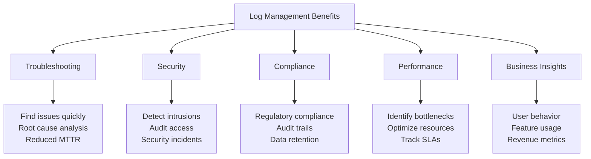
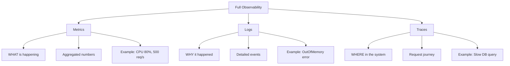
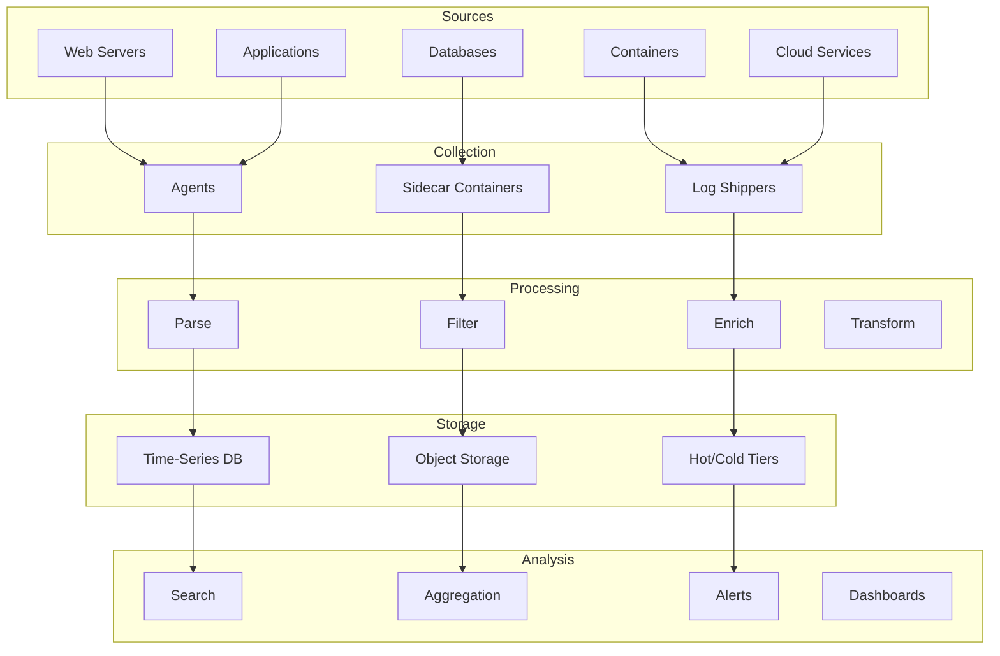
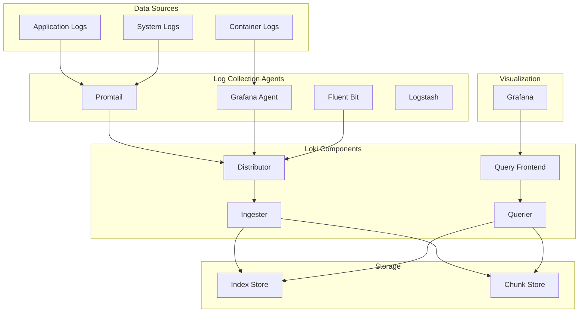
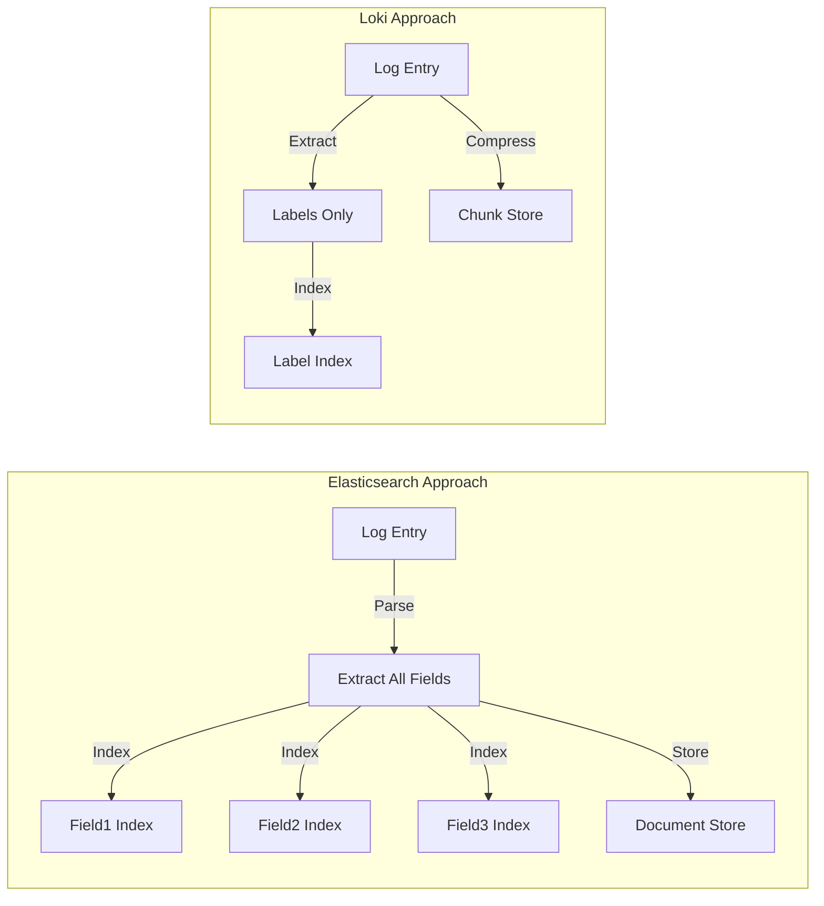
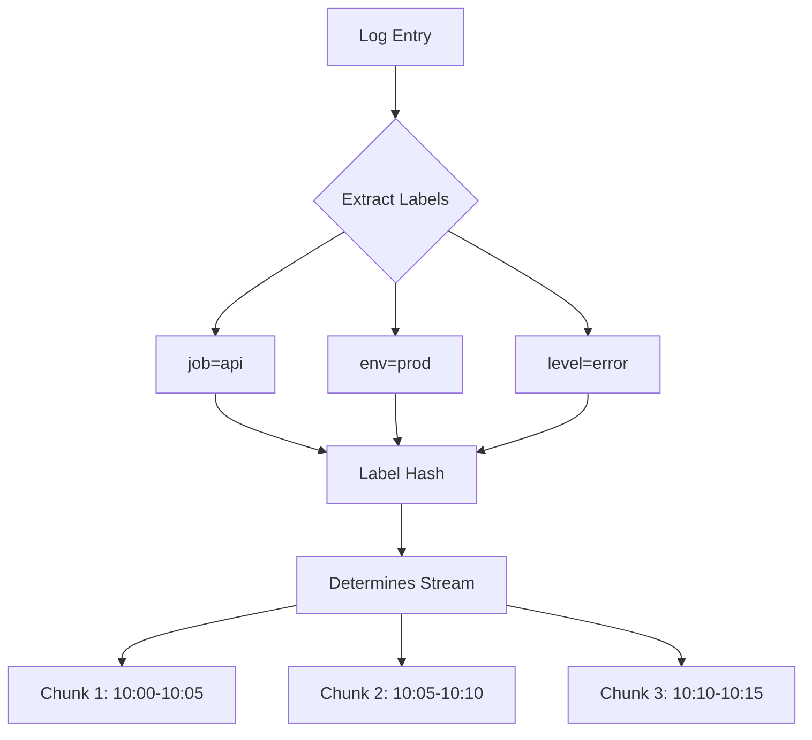
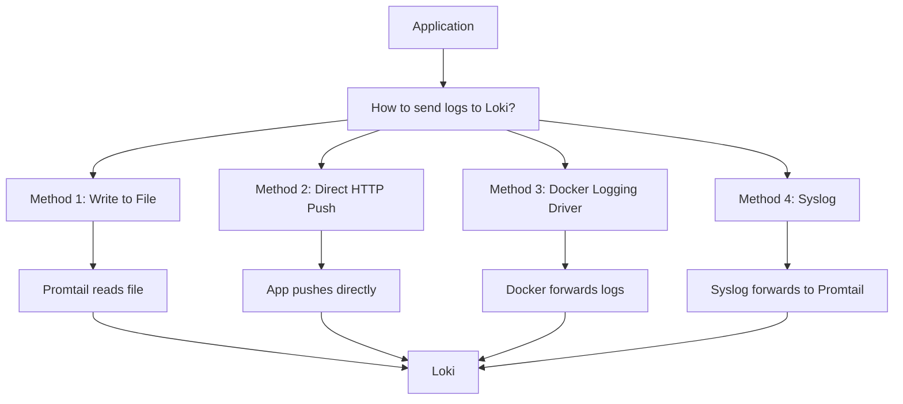

# Complete Guide to Log Monitoring & Observability
## A Comprehensive Learning Resource for DevOps Engineers

---

## 📚 Table of Contents

1. [Introduction to Log Management](#1-introduction-to-log-management)
2. [Understanding Grafana Loki](#2-understanding-grafana-loki)
3. [Installing Loki - Step by Step](#3-installing-loki-step-by-step)
4. [Sending Logs from Applications to Loki](#4-sending-logs-from-applications-to-loki)
5. [SIEM - Security Information and Event Management](#5-siem-security-information-and-event-management)
6. [Advanced Monitoring Concepts](#6-advanced-monitoring-concepts)
7. [APM - Application Performance Monitoring](#7-apm-application-performance-monitoring)
8. [ELK Stack - Elasticsearch, Logstash, Kibana](#8-elk-stack-elasticsearch-logstash-kibana)
9. [Other Log Aggregators](#9-other-log-aggregators)
10. [Comparison and Use Cases](#10-comparison-and-use-cases)
11. [Hands-On Labs](#11-hands-on-labs)
12. [Production Best Practices](#12-production-best-practices)
13. [Troubleshooting Guide](#13-troubleshooting-guide)
14. [Resources and Further Learning](#14-resources-and-further-learning)

---

## 1. Introduction to Log Management

### 1.1 What Are Logs? 📝

**Simple Explanation:**  
Logs are like a diary for your computer systems. Just as you might write "Woke up at 7 AM, had breakfast, went to work" in your diary, applications write entries like "User logged in at 10:30 AM, Database query took 250ms, Error occurred at 11:45 AM."

**Technical Definition:**  
Logs are time-stamped records of events that occur within an operating system, application, server, or network device. They provide an audit trail for understanding system behavior, troubleshooting issues, and detecting security incidents.

#### Example Log Entries:

```text
# Web Server Log (Apache/Nginx)
192.168.1.100 - - [06/Dec/2024:10:30:45 +0000] "GET /api/users/123 HTTP/1.1" 200 1234 "-" "Mozilla/5.0"

# Application Log (JSON format)
{
  "timestamp": "2024-12-06T10:30:45.123Z",
  "level": "INFO",
  "service": "user-service",
  "message": "User authentication successful",
  "user_id": "user-123",
  "ip_address": "192.168.1.100",
  "duration_ms": 45
}

# System Log (syslog)
Dec  6 10:30:45 server01 sshd[12345]: Accepted password for admin from 192.168.1.100 port 52876 ssh2

# Error Log
2024-12-06 10:31:12 ERROR [DatabaseService] Connection pool exhausted: timeout after 30000ms
  at com.example.db.ConnectionPool.getConnection(ConnectionPool.java:123)
  at com.example.service.UserService.findUser(UserService.java:45)
```

### 1.2 Why Do We Need Log Management?

**The Restaurant Analogy:**

Imagine you run a large restaurant chain with 100 locations:
- Each location has: kitchen staff, waiters, cashiers, delivery drivers
- Without a centralized system, if a customer complains:
  - ❌ You'd need to call each location individually
  - ❌ Ask each staff member what happened
  - ❌ Check multiple paper logbooks
  - ❌ This could take hours or days!

With a centralized log management system:
- ✅ Search for the order number
- ✅ See the complete journey in seconds
- ✅ Identify exactly where the problem occurred
- ✅ Fix it quickly and prevent future occurrences

**Technical Benefits:**



### 1.3 Challenges Without Log Management

**Challenge 1: Scale Problem**
```
1 server = 1 log file ✅ manageable
10 servers = 10 log files ⚠️ difficult  
100 servers = 100 log files ❌ impossible to manage manually
1000 servers = 1000 log files 💀 chaos
```

**Challenge 2: Correlation Problem**

Without centralized logging:
```text
Web Server: "Request ID abc-123 received at 10:30:45"
API Server: "Processing request at 10:30:46" (which request?)
Database: "Query executed at 10:30:47" (for which request?)
Cache: "Cache miss at 10:30:45" (related how?)
```

With centralized logging:
```text
Request ID: abc-123 (can track across all systems)
10:30:45.123 [Web] Received request
10:30:45.456 [API] Processing user-123
10:30:45.789 [Cache] Cache miss for user-123
10:30:46.012 [Database] Query: SELECT * FROM users WHERE id=123
10:30:46.500 [API] Response sent (total: 1377ms)
```

**Challenge 3: Storage and Retention**

```
Daily log volume: 1 GB per server
100 servers: 100 GB per day
30-day retention: 3 TB
1-year retention: 36 TB

Without compression and efficient storage:
- Storage costs balloon 💰
- Query performance degrades 🐌
- Backup/restore becomes nightmare 😱
```

### 1.4 The Three Pillars of Observability

Modern systems use three complementary approaches:



#### Detailed Explanation:

**1. Metrics** - The "What" (Numbers and Counters)
```text
What: CPU usage is 85%
What: Memory usage is 6.5GB out of 8GB
What: Response time average is 250ms
What: Error rate is 2.5%

Collected every few seconds
Stored as time-series data
Great for dashboards and alerts
Low storage cost
```

**2. Logs** - The "Why" (Detailed Context)
```text
Why: OutOfMemoryError occurred because large dataset was loaded
Why: Authentication failed due to expired password
Why: Payment failed because credit card was declined
Why: Slow response because database connection pool was full

Collected for every significant event
High storage cost
Essential for debugging
Rich contextual information
```

**3. Traces** - The "Where" (Request Flow)
```text
Request trace ID: abc-123
  ├─ [Web Server] 50ms - Received request
  ├─ [Load Balancer] 10ms - Route to API
  ├─ [API Server] 150ms
  │   ├─ [Auth Service] 30ms - Validate token
  │   ├─ [Business Logic] 20ms - Process request
  │   └─ [Database] 100ms - Execute query ⚠️ SLOW
  └─ [Response] Total: 210ms

Shows complete request path
Identifies bottlenecks
Measures each component's performance
```

**Real-World Example:**

```
Problem: Website is slow

Metrics tell you: Response time increased from 100ms to 2000ms
Logs tell you: Database connection errors at 10:30:45
Traces tell you: Database queries are taking 1900ms instead of 50ms

Together: Database is slow due to connection pool exhaustion, 
          caused by long-running queries from new feature deployed at 10:15
```

### 1.5 Log Management Architecture Overview



---

## 2. Understanding Grafana Loki

### 2.1 What is Loki?

**The Library Analogy:**

Think of traditional log systems (like Elasticsearch) as a library that creates a detailed index for every single word in every book:

```
Traditional Logging (Elasticsearch):
Book: "The Great Gatsby"
Index:
  - "The" appears on pages: 1, 3, 5, 7, 9...
  - "Great" appears on pages: 1, 45, 67...
  - "Gatsby" appears on pages: 1, 12, 23...
  - Every single word is indexed!
  
Result: ⚡ Very fast searches
Problem: 📚 Huge index size, expensive storage
```

Loki is like a library that only indexes book metadata (title, author, genre, shelf location):

```
Loki Approach:
Book: "The Great Gatsby"
Index:
  - Title: "The Great Gatsby"
  - Author: "F. Scott Fitzgerald"
  - Genre: "Classic Fiction"
  - Shelf: "Fiction-A-123"
  
Content: Stored compressed, not indexed word-by-word

Result: 💾 Small index, cheap storage
Search: Still fast for most use cases
```

### 2.2 Loki Architecture



#### Component Explanations:

**1. Distributor** (Traffic Controller)
```text
Role: Receives logs from agents
Tasks:
  - Validates log entries
  - Ensures timestamps are correct
  - Hashes labels to determine which ingester gets the log
  - Rate limiting and validation

Analogy: Like a mail sorting facility that reads addresses 
         and sends letters to the correct destination
```

**2. Ingester** (Data Writer)
```text
Role: Writes logs to storage
Tasks:
  - Receives logs from distributor
  - Builds compressed chunks of log data
  - Creates indexes for labels
  - Writes to persistent storage

Analogy: Like a warehouse worker who organizes packages 
         into boxes and stores them on shelves
```

**3. Querier** (Data Reader)
```text
Role: Answers queries
Tasks:
  - Receives queries from Grafana
  - Fetches data from ingesters and storage
  - Filters and returns results
  - Merges results from multiple sources

Analogy: Like a librarian who finds books based on 
         the catalog information
```

**4. Query Frontend** (Load Balancer)
```text
Role: Optimizes queries
Tasks:
  - Splits large queries into smaller ones
  - Caches query results
  - Retries failed queries
  - Load balances across queriers

Analogy: Like a restaurant host who manages the waiting line 
         and directs customers to available tables
```

### 2.3 How Loki Differs from Elasticsearch

| Aspect | Elasticsearch | Loki |
|--------|--------------|------|
| **Indexing Strategy** | Full-text index of all log content | Index labels only |
| **Storage Model** | Inverted index for every field | Compressed chunks with label index |
| **Query Language** | Lucene query syntax | LogQL (like PromQL) |
| **Storage Cost** | High (indexes are large) | Low (indexes are tiny) |
| **Memory Usage** | High (caches indexes) | Low (streams data) |
| **Write Performance** | Good | Excellent |
| **Query Performance** | Very fast for indexed fields | Fast for label filters, grep-like for content |
| **Best Use Case** | Complex analytics, full-text search | Log aggregation, streaming |
| **Learning Curve** | Steep | Gentle (especially if you know Prometheus) |
| **Operational Complexity** | High (many knobs to tune) | Low (fewer moving parts) |

**Visual Comparison:**



### 2.4 Loki's Label System (The Magic!)

**Understanding Labels:**

Labels in Loki are like filing cabinet categories:

```text
Physical Filing Cabinet:
  └─ Drawer: "Customers"
      ├─ Folder: "Active"
      │   └─ Documents sorted by date
      └─ Folder: "Inactive"
          └─ Documents sorted by date

Loki Labels:
  └─ job="customer-api"
      ├─ environment="production"
      │   ├─ region="us-east"
      │   │   └─ Log streams...
      │   └─ region="us-west"
      │       └─ Log streams...
      └─ environment="staging"
          └─ Log streams...
```

**Label Structure:**

```json
{
  "job": "api-service",           // What: Which application
  "environment": "production",     // Where: Which environment  
  "region": "us-east-1",          // Where: Which region
  "level": "error",               // What: Log severity
  "version": "v1.2.3",            // What: Application version
  "pod": "api-7d4f9-xyz"          // Where: Specific instance
}
```

**How Labels Work:**



**Label Best Practices:**

✅ **Good Labels** (Low cardinality):
```text
job="api-service"           // Limited number of services
environment="production"    // Few environments
region="us-east-1"         // Fixed number of regions
level="error"              // Fixed severity levels
```

❌ **Bad Labels** (High cardinality):
```text
user_id="user-12345"       // Millions of users!
request_id="abc-123-def"   // Unique per request!
ip_address="192.168.1.1"   // Many unique IPs!
trace_id="xyz-789"         // Unique per trace!
```

**Why Bad Labels Are Bad:**

```text
With good labels (10 total combinations):
  - Small index
  - Fast queries
  - Low memory usage

With bad labels (millions of combinations):
  - Huge index (defeats the purpose!)
  - Slow queries
  - High memory usage
  - Essentially becomes like Elasticsearch
```

**The Right Way to Handle High-Cardinality Data:**

```logql
# ❌ WRONG: Don't use user_id as label
{user_id="user-12345"}

# ✅ RIGHT: Use user_id in log content, filter in query
{job="api"} | json | user_id="user-12345"

# ❌ WRONG: Don't use request_id as label  
{request_id="abc-123"}

# ✅ RIGHT: Search in log content
{job="api"} |= "abc-123"
```

### 2.5 LogQL - Loki's Query Language

**LogQL is like a combination of grep and SQL:**

```logql
# Basic format:
{label_selector} | filter_expression | aggregation

# Think of it as:
{WHERE to look} | WHAT to find | HOW to summarize
```

#### LogQL Examples:

**1. Simple Label Selection**
```logql
# Get all logs from api service
{job="api-service"}

# Get errors from production
{job="api-service", environment="production", level="error"}

# Multiple services
{job=~"api-service|web-service"}

# NOT operator
{job="api-service", level!="debug"}
```

**2. Text Filtering**
```logql
# Contains "error" (case-sensitive)
{job="api"} |= "error"

# Does NOT contain "debug"
{job="api"} != "debug"

# Regex match
{job="api"} |~ "error|timeout|failed"

# Regex NOT match
{job="api"} !~ "debug|trace"
```

**3. JSON Parsing**
```logql
# Parse JSON and filter
{job="api"} | json | status_code="500"

# Extract specific field
{job="api"} | json | line_format "{{.user_id}} - {{.message}}"

# Multiple conditions
{job="api"} | json | status_code="500" | duration_ms > 1000
```

**4. Aggregations and Stats**
```logql
# Count logs per minute
sum(count_over_time({job="api"}[1m]))

# Count by level
sum by (level) (count_over_time({job="api"}[5m]))

# Calculate rate (logs per second)
rate({job="api"}[1m])

# Calculate error rate percentage
sum(rate({job="api", level="error"}[5m])) /
sum(rate({job="api"}[5m])) * 100
```

**5. Advanced Queries**
```logql
# P95 latency from JSON logs
quantile_over_time(0.95, 
  {job="api"} | json | unwrap duration_ms [5m]
)

# Top 10 error messages
topk(10, 
  sum by (message) (count_over_time({level="error"}[1h]))
)

# Average response time by endpoint
avg_over_time(
  {job="api"} | json | endpoint="/api/users" | unwrap duration_ms [5m]
)
```

### 2.6 When to Use Loki

**✅ Perfect for Loki:**
- Kubernetes and container environments
- High log volume with simple query needs
- Cost is a major concern
- Already using Prometheus and Grafana
- Log streaming and tailing
- Debugging applications
- Basic alerting on log patterns

**❌ Not ideal for Loki:**
- Need complex full-text search
- Require advanced aggregations across all fields
- Compliance needs every field indexed
- Complex security analytics (SIEM)
- Need to query by high-cardinality fields frequently

**Cost Comparison Example:**

```text
Scenario: 1TB logs/day, 30-day retention = 30TB total

Elasticsearch:
  Storage: 30TB × $0.10/GB = $3,000/month
  Compute: High-memory instances = $2,000/month
  Total: ~$5,000/month

Loki:
  Storage: 30TB × $0.02/GB (compressed) = $600/month
  Compute: Low-memory instances = $500/month
  Total: ~$1,100/month

Savings: ~78% cheaper! 💰
```

---

## 3. Installing Loki - Step by Step

### 3.1 Prerequisites and System Requirements

**Minimum Requirements:**
```
CPU: 2 cores
RAM: 2 GB (4 GB recommended)
Disk: 10 GB (varies with log volume)
OS: Linux (Ubuntu 20.04+, CentOS 7+, any Linux)
```

**For Production:**
```
CPU: 4+ cores
RAM: 8+ GB
Disk: SSD preferred, size based on retention
Network: Low latency between components
```

### 3.2 Installation Method 1: Docker Compose (Fastest)

This is the quickest way to get started. Perfect for learning and testing.

#### Step 1: Create Directory Structure

```bash
# Create project directory
mkdir loki-stack
cd loki-stack

# Create subdirectories
mkdir -p config data/loki data/grafana data/promtail
chmod -R 777 data/
```

#### Step 2: Create Loki Configuration

Create `config/loki-config.yaml`:

```yaml
auth_enabled: false

server:
  http_listen_port: 3100
  grpc_listen_port: 9096
  log_level: info

common:
  instance_addr: 127.0.0.1
  path_prefix: /tmp/loki
  storage:
    filesystem:
      chunks_directory: /tmp/loki/chunks
      rules_directory: /tmp/loki/rules
  replication_factor: 1
  ring:
    kvstore:
      store: inmemory

query_range:
  results_cache:
    cache:
      embedded_cache:
        enabled: true
        max_size_mb: 100

schema_config:
  configs:
    - from: 2024-01-01
      store: tsdb
      object_store: filesystem
      schema: v13
      index:
        prefix: index_
        period: 24h

storage_config:
  tsdb_shipper:
    active_index_directory: /tmp/loki/index
    cache_location: /tmp/loki/cache
  filesystem:
    directory: /tmp/loki/chunks

compactor:
  working_directory: /tmp/loki/compactor
  compaction_interval: 10m
  retention_enabled: true
  retention_delete_delay: 2h
  retention_delete_worker_count: 150

limits_config:
  retention_period: 744h  # 31 days
  allow_structured_metadata: true
  max_query_length: 0h
  reject_old_samples: true
  reject_old_samples_max_age: 168h
  ingestion_rate_mb: 10
  ingestion_burst_size_mb: 20
  per_stream_rate_limit: 10MB
  per_stream_rate_limit_burst: 20MB

ruler:
  alertmanager_url: http://alertmanager:9093
  storage:
    type: local
    local:
      directory: /tmp/loki/rules
  rule_path: /tmp/loki/rules-temp
  enable_api: true
```

#### Step 3: Create Promtail Configuration

Create `config/promtail-config.yaml`:

```yaml
server:
  http_listen_port: 9080
  grpc_listen_port: 0
  log_level: info

positions:
  filename: /tmp/positions.yaml

clients:
  - url: http://loki:3100/loki/api/v1/push
    batch_wait: 1s
    batch_size: 1048576  # 1MB

scrape_configs:
  # System logs
  - job_name: system
    static_configs:
      - targets:
          - localhost
        labels:
          job: varlogs
          __path__: /var/log/*log

  # Docker container logs
  - job_name: containers
    docker_sd_configs:
      - host: unix:///var/run/docker.sock
        refresh_interval: 5s
    relabel_configs:
      - source_labels: ['__meta_docker_container_name']
        regex: '/(.*)'
        target_label: 'container'
      - source_labels: ['__meta_docker_container_log_stream']
        target_label: 'stream'
    pipeline_stages:
      - docker: {}
      - json:
          expressions:
            level: level
            message: message
      - labels:
          level:
```

#### Step 4: Create Docker Compose File

Create `docker-compose.yml`:

```yaml
version: "3.8"

networks:
  loki:
    driver: bridge

volumes:
  loki-data:
  grafana-data:
  promtail-data:

services:
  # Loki - Log aggregation system
  loki:
    image: grafana/loki:3.4.1
    container_name: loki
    ports:
      - "3100:3100"
      - "9096:9096"
    volumes:
      - ./config/loki-config.yaml:/etc/loki/local-config.yaml
      - loki-data:/tmp/loki
    command: -config.file=/etc/loki/local-config.yaml
    networks:
      - loki
    restart: unless-stopped
    healthcheck:
      test: ["CMD", "wget", "--spider", "--quiet", "http://localhost:3100/ready"]
      interval: 10s
      timeout: 5s
      retries: 5

  # Promtail - Log collector
  promtail:
    image: grafana/promtail:3.4.1
    container_name: promtail
    volumes:
      - /var/log:/var/log:ro
      - /var/lib/docker/containers:/var/lib/docker/containers:ro
      - /var/run/docker.sock:/var/run/docker.sock:ro
      - ./config/promtail-config.yaml:/etc/promtail/config.yml
      - promtail-data:/tmp
    command: -config.file=/etc/promtail/config.yml
    networks:
      - loki
    depends_on:
      - loki
    restart: unless-stopped

  # Grafana - Visualization
  grafana:
    image: grafana/grafana:latest
    container_name: grafana
    ports:
      - "3000:3000"
    environment:
      - GF_SECURITY_ADMIN_PASSWORD=admin
      - GF_SECURITY_ADMIN_USER=admin
      - GF_USERS_ALLOW_SIGN_UP=false
      - GF_SERVER_ROOT_URL=http://localhost:3000
      - GF_INSTALL_PLUGINS=grafana-clock-panel
    volumes:
      - grafana-data:/var/lib/grafana
    networks:
      - loki
    depends_on:
      - loki
    restart: unless-stopped

  # Sample log generator for testing
  log-generator:
    image: mingrammer/flog
    container_name: log-generator
    command: 
      - -f
      - json
      - -l
      - -d
      - "1s"
      - -n
      - "1000000"
    networks:
      - loki
    restart: unless-stopped
```

#### Step 5: Start the Stack

```bash
# Start all services in detached mode
docker-compose up -d

# Check if services are running
docker-compose ps

# Expected output:
# NAME              IMAGE                        STATUS
# grafana           grafana/grafana:latest       Up
# loki              grafana/loki:3.4.1           Up (healthy)
# promtail          grafana/promtail:3.4.1       Up
# log-generator     mingrammer/flog              Up

# View logs from specific service
docker-compose logs -f loki

# View logs from all services
docker-compose logs -f
```

#### Step 6: Verify Loki is Running

```bash
# Check Loki health
curl http://localhost:3100/ready

# Expected: ready

# Check Loki metrics
curl http://localhost:3100/metrics | head -20

# Query Loki API directly
curl -G -s "http://localhost:3100/loki/api/v1/query" \
  --data-urlencode 'query={job="varlogs"}' \
  --data-urlencode 'limit=5' | jq

# Expected: JSON response with log entries
```

#### Step 7: Configure Grafana

1. **Open Grafana:**
   - URL: `http://localhost:3000`
   - Username: `admin`
   - Password: `admin`
   - (You'll be prompted to change password)

2. **Add Loki Data Source:**
   ```
   Left Menu → Configuration (⚙️) → Data Sources
   → Add data source
   → Select "Loki"
   
   Settings:
   - Name: Loki
   - URL: http://loki:3100
   - Click "Save & Test"
   
   Expected: "Data source connected and labels found"
   ```

3. **Verify Data is Flowing:**
   ```
   Left Menu → Explore (🧭 compass icon)
   
   In Log browser:
   - Select label: job
   - Select value: varlogs or containers
   - Click "Show logs"
   
   You should see logs appearing!
   ```

#### Step 8: Your First Queries

Try these queries in Grafana Explore:

```logql
# 1. View all logs
{job="varlogs"}

# 2. View container logs
{job="containers"}

# 3. View logs from log-generator
{container="log-generator"}

# 4. Filter logs containing "error"
{job="containers"} |= "error"

# 5. Count logs per minute
sum(count_over_time({job="containers"}[1m]))

# 6. View logs in real-time (Live tail)
# Click the "Live" button in the top right

# 7. Parse JSON logs
{container="log-generator"} | json

# 8. Filter by JSON field
{container="log-generator"} | json | level="error"
```

### 3.3 Installation Method 2: Linux Binary (Production-Ready)

This method is better for production as you have more control.

#### Step 1: Download Loki

```bash
# Update system
sudo apt update && sudo apt upgrade -y

# Install dependencies
sudo apt install -y wget unzip curl

# Download latest Loki
cd /tmp
wget https://github.com/grafana/loki/releases/download/v3.4.1/loki-linux-amd64.zip

# Extract
unzip loki-linux-amd64.zip

# Move to /usr/local/bin
sudo mv loki-linux-amd64 /usr/local/bin/loki
sudo chmod +x /usr/local/bin/loki

# Verify installation
/usr/local/bin/loki --version
```

#### Step 2: Create Loki User and Directories

```bash
# Create system user
sudo useradd --system --no-create-home --shell /bin/false loki

# Create directories
sudo mkdir -p /etc/loki
sudo mkdir -p /var/lib/loki/{wal,chunks,index,compactor}
sudo mkdir -p /var/log/loki

# Set ownership
sudo chown -R loki:loki /var/lib/loki
sudo chown -R loki:loki /var/log/loki
sudo chown -R loki:loki /etc/loki
```

#### Step 3: Create Loki Configuration

```bash
sudo nano /etc/loki/config.yml
```

```yaml
auth_enabled: false

server:
  http_listen_port: 3100
  grpc_listen_port: 9096
  log_level: info
  log_format: logfmt

common:
  instance_addr: 127.0.0.1
  path_prefix: /var/lib/loki
  storage:
    filesystem:
      chunks_directory: /var/lib/loki/chunks
      rules_directory: /var/lib/loki/rules
  replication_factor: 1
  ring:
    kvstore:
      store: inmemory

ingester:
  lifecycler:
    ring:
      kvstore:
        store: inmemory
      replication_factor: 1
    final_sleep: 0s
  chunk_idle_period: 5m
  max_chunk_age: 1h
  chunk_target_size: 1048576
  chunk_retain_period: 30s
  max_transfer_retries: 0
  wal:
    enabled: true
    dir: /var/lib/loki/wal
    checkpoint_duration: 5m
    flush_on_shutdown: true
    replay_memory_ceiling: 4GB

schema_config:
  configs:
    - from: 2024-01-01
      store: tsdb
      object_store: filesystem
      schema: v13
      index:
        prefix: index_
        period: 24h

storage_config:
  tsdb_shipper:
    active_index_directory: /var/lib/loki/index
    cache_location: /var/lib/loki/cache
    cache_ttl: 24h
    shared_store: filesystem
  filesystem:
    directory: /var/lib/loki/chunks

compactor:
  working_directory: /var/lib/loki/compactor
  compaction_interval: 10m
  retention_enabled: true
  retention_delete_delay: 2h
  retention_delete_worker_count: 150
  delete_request_store: filesystem

limits_config:
  enforce_metric_name: false
  reject_old_samples: true
  reject_old_samples_max_age: 168h
  ingestion_rate_mb: 10
  ingestion_burst_size_mb: 20
  per_stream_rate_limit: 10MB
  per_stream_rate_limit_burst: 20MB
  max_query_series: 500
  max_query_parallelism: 32
  max_query_length: 0h
  max_streams_per_user: 0
  max_global_streams_per_user: 0
  retention_period: 744h  # 31 days

chunk_store_config:
  max_look_back_period: 0s

table_manager:
  retention_deletes_enabled: true
  retention_period: 744h

ruler:
  storage:
    type: local
    local:
      directory: /var/lib/loki/rules
  rule_path: /var/lib/loki/rules-temp
  alertmanager_url: http://localhost:9093
  ring:
    kvstore:
      store: inmemory
  enable_api: true
  enable_alertmanager_v2: true
```

#### Step 4: Create Systemd Service

```bash
sudo nano /etc/systemd/system/loki.service
```

```ini
[Unit]
Description=Loki Log Aggregation System
Documentation=https://grafana.com/docs/loki/latest/
After=network-online.target
Wants=network-online.target

[Service]
Type=simple
User=loki
Group=loki
ExecStart=/usr/local/bin/loki -config.file=/etc/loki/config.yml
Restart=always
RestartSec=10s
StandardOutput=journal
StandardError=journal
SyslogIdentifier=loki

# Security hardening
NoNewPrivileges=true
PrivateTmp=true
ProtectSystem=strict
ProtectHome=true
ReadWritePaths=/var/lib/loki /var/log/loki
ProtectKernelTunables=true
ProtectControlGroups=true
RestrictRealtime=true
RestrictNamespaces=true

# Resource limits
LimitNOFILE=65536
LimitNPROC=512

[Install]
WantedBy=multi-user.target
```

#### Step 5: Start Loki Service

```bash
# Set correct permissions
sudo chown loki:loki /etc/loki/config.yml
sudo chmod 640 /etc/loki/config.yml

# Reload systemd
sudo systemctl daemon-reload

# Enable service to start on boot
sudo systemctl enable loki

# Start Loki
sudo systemctl start loki

# Check status
sudo systemctl status loki

# View logs
sudo journalctl -u loki -f

# Test Loki is responding
curl http://localhost:3100/ready
```

#### Step 6: Install Promtail

```bash
# Download Promtail
cd /tmp
wget https://github.com/grafana/loki/releases/download/v3.4.1/promtail-linux-amd64.zip
unzip promtail-linux-amd64.zip
sudo mv promtail-linux-amd64 /usr/local/bin/promtail
sudo chmod +x /usr/local/bin/promtail

# Create directories
sudo mkdir -p /etc/promtail
sudo mkdir -p /var/lib/promtail

# Verify
/usr/local/bin/promtail --version
```

#### Step 7: Configure Promtail

```bash
sudo nano /etc/promtail/config.yml
```

```yaml
server:
  http_listen_port: 9080
  grpc_listen_port: 0
  log_level: info

positions:
  filename: /var/lib/promtail/positions.yaml

clients:
  - url: http://localhost:3100/loki/api/v1/push
    batch_wait: 1s
    batch_size: 1048576
    timeout: 10s
    backoff_config:
      min_period: 500ms
      max_period: 5m
      max_retries: 10

scrape_configs:
  # System logs - syslog
  - job_name: system
    static_configs:
      - targets:
          - localhost
        labels:
          job: syslog
          host: __hostname__
          __path__: /var/log/syslog
    pipeline_stages:
      - regex:
          expression: '^(?P<timestamp>\w+\s+\d+\s+\d+:\d+:\d+)\s+(?P<hostname>\S+)\s+(?P<program>\S+?)(\[(?P<pid>\d+)\])?:\s+(?P<message>.*)$'
      - labels:
          program:
      - timestamp:
          source: timestamp
          format: "Jan 02 15:04:05"

  # System logs - auth
  - job_name: auth
    static_configs:
      - targets:
          - localhost
        labels:
          job: auth
          host: __hostname__
          __path__: /var/log/auth.log
    pipeline_stages:
      - regex:
          expression: '^(?P<timestamp>\w+\s+\d+\s+\d+:\d+:\d+)\s+(?P<hostname>\S+)\s+(?P<program>\S+?)(\[(?P<pid>\d+)\])?:\s+(?P<message>.*)$'
      - labels:
          program:

  # Application logs (JSON format)
  - job_name: applications
    static_configs:
      - targets:
          - localhost
        labels:
          job: app
          environment: production
          host: __hostname__
          __path__: /var/log/app/*.log
    pipeline_stages:
      - json:
          expressions:
            level: level
            timestamp: timestamp
            service: service
            message: message
      - labels:
          level:
          service:
      - timestamp:
          source: timestamp
          format: RFC3339Nano

  # Nginx access logs
  - job_name: nginx-access
    static_configs:
      - targets:
          - localhost
        labels:
          job: nginx
          type: access
          host: __hostname__
          __path__: /var/log/nginx/access.log
    pipeline_stages:
      - regex:
          expression: '^(?P<remote_addr>[\w\.]+) - (?P<remote_user>[^ ]*) \[(?P<time_local>.*?)\] "(?P<method>\S+)(?: +(?P<path>[^\"]*?)(?: +\S*)?)?" (?P<status>\d+) (?P<body_bytes_sent>\d+) "(?P<http_referer>[^\"]*)" "(?P<http_user_agent>[^\"]*)".*$'
      - labels:
          method:
          status:
      - timestamp:
          source: time_local
          format: "02/Jan/2006:15:04:05 -0700"

  # Nginx error logs
  - job_name: nginx-error
    static_configs:
      - targets:
          - localhost
        labels:
          job: nginx
          type: error
          host: __hostname__
          __path__: /var/log/nginx/error.log
```

Replace `__hostname__` with your actual hostname:
```bash
HOSTNAME=$(hostname)
sudo sed -i "s/__hostname__/$HOSTNAME/g" /etc/promtail/config.yml
```

#### Step 8: Create Promtail Service

```bash
sudo nano /etc/systemd/system/promtail.service
```

```ini
[Unit]
Description=Promtail Log Collector
Documentation=https://grafana.com/docs/loki/latest/clients/promtail/
After=network-online.target
Wants=network-online.target

[Service]
Type=simple
User=root
Group=root
ExecStart=/usr/local/bin/promtail -config.file=/etc/promtail/config.yml
Restart=always
RestartSec=10s
StandardOutput=journal
StandardError=journal
SyslogIdentifier=promtail

# Security
NoNewPrivileges=true
PrivateTmp=true

# Resource limits
LimitNOFILE=65536

[Install]
WantedBy=multi-user.target
```

#### Step 9: Start Promtail

```bash
# Reload systemd
sudo systemctl daemon-reload

# Enable and start Promtail
sudo systemctl enable promtail
sudo systemctl start promtail

# Check status
sudo systemctl status promtail

# View logs
sudo journalctl -u promtail -f
```

#### Step 10: Test End-to-End

```bash
# Generate a test log entry
logger "TEST: This is a test message from $(whoami)"

# Wait 5 seconds for processing

# Query Loki
curl -G -s "http://localhost:3100/loki/api/v1/query" \
  --data-urlencode 'query={job="syslog"} |= "TEST"' \
  --data-urlencode 'limit=5' | jq '.data.result'

# You should see your test message!
```

#### Step 11: Install Grafana

```bash
# Add Grafana GPG key and repository
sudo apt-get install -y software-properties-common
sudo add-apt-repository "deb https://packages.grafana.com/oss/deb stable main"
wget -q -O - https://packages.grafana.com/gpg.key | sudo apt-key add -

# Install Grafana
sudo apt-get update
sudo apt-get install -y grafana

# Enable and start Grafana
sudo systemctl enable grafana-server
sudo systemctl start grafana-server

# Check status
sudo systemctl status grafana-server

# Access Grafana at http://your-server-ip:3000
# Default credentials: admin / admin
```

Continue with Grafana configuration as described in the Docker section above.

### 3.4 Troubleshooting Installation Issues

**Issue 1: Loki Won't Start**

```bash
# Check logs
sudo journalctl -u loki -n 50 --no-pager

# Common causes:
# 1. Port already in use
sudo netstat -tulpn | grep 3100

# 2. Permission denied
ls -la /var/lib/loki
sudo chown -R loki:loki /var/lib/loki

# 3. Invalid configuration
/usr/local/bin/loki -config.file=/etc/loki/config.yml -verify-config
```

**Issue 2: Promtail Not Sending Logs**

```bash
# Check Promtail status
sudo systemctl status promtail

# Check if Promtail can reach Loki
curl -v http://localhost:3100/ready

# Check Promtail targets
curl http://localhost:9080/targets

# Check file permissions
sudo ls -la /var/log/syslog
# Promtail needs read access

# Test with verbose logging
sudo /usr/local/bin/promtail -config.file=/etc/promtail/config.yml -log.level=debug
```

**Issue 3: No Data in Grafana**

```bash
# 1. Verify Loki has data
curl -G -s "http://localhost:3100/loki/api/v1/labels" | jq

# Should show: ["job", "host", ...]

# 2. Check label values
curl -G -s "http://localhost:3100/loki/api/v1/label/job/values" | jq

# Should show your job names

# 3. Query directly
curl -G -s "http://localhost:3100/loki/api/v1/query" \
  --data-urlencode 'query={job="syslog"}' \
  --data-urlencode 'limit=10' | jq

# 4. In Grafana, check data source connection
# Settings → Data Sources → Loki → Save & Test
```

**Issue 4: High Memory Usage**

```bash
# Check Loki memory usage
ps aux | grep loki

# Reduce cache size in /etc/loki/config.yml:
query_range:
  results_cache:
    cache:
      embedded_cache:
        max_size_mb: 50  # Reduce from 100

# Restart Loki
sudo systemctl restart loki
```

---

## 4. Sending Logs from Applications to Loki

### 4.1 Overview of Log Collection Methods



### 4.2 Method 1: File-Based Logging (Most Common)

**How it works:**
1. Application writes logs to a file
2. Promtail monitors the file
3. Promtail sends logs to Loki

**Advantages:**
- ✅ Simple and reliable
- ✅ Works with any application
- ✅ No code changes needed
- ✅ Promtail handles retries and buffering

#### Example: Python Flask Application

Create directory structure:
```bash
mkdir -p python-logging-example
cd python-logging-example
```

Create `app.py`:

```python
#!/usr/bin/env python3
"""
Flask application with structured JSON logging to file
Promtail will collect logs from this file
"""

from flask import Flask, request, jsonify
import logging
import json
import time
import random
import uuid
from datetime import datetime
from logging.handlers import RotatingFileHandler
import os

# Custom JSON formatter
class JSONFormatter(logging.Formatter):
    """Format logs as JSON for easy parsing"""
    
    def format(self, record):
        log_data = {
            'timestamp': datetime.utcnow().isoformat() + 'Z',
            'level': record.levelname,
            'logger': record.name,
            'message': record.getMessage(),
            'module': record.module,
            'function': record.funcName,
            'line_number': record.lineno,
            'process_id': record.process,
            'thread_id': record.thread
        }
        
        # Add custom fields if they exist
        if hasattr(record, 'user_id'):
            log_data['user_id'] = record.user_id
        if hasattr(record, 'request_id'):
            log_data['request_id'] = record.request_id
        if hasattr(record, 'duration_ms'):
            log_data['duration_ms'] = record.duration_ms
        if hasattr(record, 'status_code'):
            log_data['status_code'] = record.status_code
        if hasattr(record, 'endpoint'):
            log_data['endpoint'] = record.endpoint
        if hasattr(record, 'method'):
            log_data['method'] = record.method
            
        # Add exception info if present
        if record.exc_info:
            log_data['exception'] = self.formatException(record.exc_info)
            
        return json.dumps(log_data)

# Setup application logger
def setup_logger(name='myapp', log_file='/var/log/myapp/app.log', level=logging.INFO):
    """Configure application logging"""
    
    # Create logger
    logger = logging.getLogger(name)
    logger.setLevel(level)
    logger.handlers = []  # Clear existing handlers
    
    # Create log directory if it doesn't exist
    os.makedirs(os.path.dirname(log_file), exist_ok=True)
    
    # File handler with JSON format and rotation
    file_handler = RotatingFileHandler(
        log_file,
        maxBytes=10 * 1024 * 1024,  # 10MB
        backupCount=5
    )
    file_handler.setFormatter(JSONFormatter())
    file_handler.setLevel(level)
    logger.addHandler(file_handler)
    
    # Console handler with simple format for debugging
    console_handler = logging.StreamHandler()
    console_formatter = logging.Formatter(
        '%(asctime)s - %(name)s - %(levelname)s - %(message)s'
    )
    console_handler.setFormatter(console_formatter)
    console_handler.setLevel(level)
    logger.addHandler(console_handler)
    
    return logger

# Initialize Flask app
app = Flask(__name__)
logger = setup_logger()

# Middleware to log all requests
@app.before_request
def log_request_start():
    """Log when request starts"""
    request.start_time = time.time()
    request.request_id = str(uuid.uuid4())
    
    logger.info(
        f"Request started: {request.method} {request.path}",
        extra={
            'request_id': request.request_id,
            'method': request.method,
            'endpoint': request.path,
            'client_ip': request.remote_addr,
            'user_agent': request.headers.get('User-Agent', 'Unknown')
        }
    )

@app.after_request
def log_request_end(response):
    """Log when request completes"""
    duration_ms = (time.time() - request.start_time) * 1000
    
    logger.info(
        f"Request completed: {request.method} {request.path} - {response.status_code}",
        extra={
            'request_id': request.request_id,
            'method': request.method,
            'endpoint': request.path,
            'status_code': response.status_code,
            'duration_ms': round(duration_ms, 2)
        }
    )
    
    return response

# Routes
@app.route('/health')
def health():
    """Health check endpoint"""
    logger.info("Health check requested")
    return jsonify({"status": "healthy", "timestamp": datetime.utcnow().isoformat()})

@app.route('/api/users/<user_id>')
def get_user(user_id):
    """Get user by ID (simulated)"""
    logger.info(
        f"Fetching user: {user_id}",
        extra={'user_id': user_id, 'request_id': request.request_id}
    )
    
    # Simulate database query
    time.sleep(random.uniform(0.01, 0.1))
    
    # Simulate occasional errors
    if random.random() < 0.1:  # 10% error rate
        logger.error(
            f"Failed to fetch user: {user_id} - Database connection timeout",
            extra={'user_id': user_id, 'request_id': request.request_id}
        )
        return jsonify({"error": "Database connection timeout"}), 500
    
    # Success response
    user_data = {
        "id": user_id,
        "name": f"User {user_id}",
        "email": f"user{user_id}@example.com",
        "created_at": "2024-01-01T00:00:00Z"
    }
    
    return jsonify(user_data)

@app.route('/api/orders', methods=['POST'])
def create_order():
    """Create a new order"""
    order_data = request.get_json() or {}
    order_id = str(uuid.uuid4())
    
    logger.info(
        f"Creating order: {order_id}",
        extra={
            'order_id': order_id,
            'user_id': order_data.get('user_id'),
            'request_id': request.request_id
        }
    )
    
    # Simulate processing
    time.sleep(random.uniform(0.05, 0.2))
    
    # Simulate validation errors
    if not order_data.get('user_id'):
        logger.warning(
            f"Order validation failed: missing user_id",
            extra={'order_id': order_id, 'request_id': request.request_id}
        )
        return jsonify({"error": "user_id is required"}), 400
    
    # Simulate occasional failures
    if random.random() < 0.05:  # 5% failure rate
        logger.error(
            f"Order creation failed: {order_id} - Payment gateway timeout",
            extra={
                'order_id': order_id,
                'user_id': order_data.get('user_id'),
                'request_id': request.request_id
            }
        )
        return jsonify({"error": "Payment gateway timeout"}), 500
    
    # Success
    response = {
        "order_id": order_id,
        "status": "created",
        "user_id": order_data.get('user_id'),
        "total": order_data.get('total', 0),
        "created_at": datetime.utcnow().isoformat()
    }
    
    logger.info(
        f"Order created successfully: {order_id}",
        extra={
            'order_id': order_id,
            'user_id': order_data.get('user_id'),
            'request_id': request.request_id,
            'order_total': order_data.get('total', 0)
        }
    )
    
    return jsonify(response), 201

@app.route('/api/slow')
def slow_endpoint():
    """Intentionally slow endpoint for testing"""
    logger.warning(
        "Slow endpoint called",
        extra={'request_id': request.request_id}
    )
    
    time.sleep(2)
    return jsonify({"message": "This took 2 seconds!"})

@app.route('/api/error')
def error_endpoint():
    """Endpoint that randomly throws errors"""
    if random.random() < 0.5:
        logger.error(
            "Intentional error triggered",
            extra={'request_id': request.request_id},
            exc_info=True
        )
        raise ValueError("Something went wrong!")
    
    return jsonify({"message": "Success!"})

@app.errorhandler(Exception)
def handle_exception(e):
    """Handle uncaught exceptions"""
    logger.exception(
        f"Uncaught exception: {str(e)}",
        extra={'request_id': getattr(request, 'request_id', 'unknown')}
    )
    return jsonify({"error": "Internal server error"}), 500

if __name__ == '__main__':
    logger.info("="*50)
    logger.info("Application starting")
    logger.info("Logging to: /var/log/myapp/app.log")
    logger.info("="*50)
    
    app.run(
        host='0.0.0.0',
        port=5000,
        debug=False  # Don't use debug in production
    )
```

Create `requirements.txt`:
```
Flask==3.0.0
```

Create `Dockerfile`:
```dockerfile
FROM python:3.11-slim

WORKDIR /app

# Create log directory
RUN mkdir -p /var/log/myapp && chmod 777 /var/log/myapp

# Copy requirements and install
COPY requirements.txt .
RUN pip install --no-cache-dir -r requirements.txt

# Copy application
COPY app.py .

# Expose port
EXPOSE 5000

# Run application
CMD ["python", "app.py"]
```

Build and run:
```bash
# Build image
docker build -t python-logging-app .

# Run container
docker run -d \
  --name python-app \
  -p 5000:5000 \
  -v $(pwd)/logs:/var/log/myapp \
  python-logging-app

# Generate some traffic
for i in {1..20}; do
  curl http://localhost:5000/api/users/$i
  curl -X POST http://localhost:5000/api/orders \
    -H "Content-Type: application/json" \
    -d "{\"user_id\": \"user-$i\", \"total\": $(( RANDOM % 1000 ))}"
  sleep 0.5
done

# View logs
tail -f logs/app.log
```

Configure Promtail to collect these logs. Add to `promtail-config.yaml`:

```yaml
scrape_configs:
  - job_name: python-app
    static_configs:
      - targets:
          - localhost
        labels:
          job: python-app
          app: order-service
          environment: production
          __path__: /path/to/logs/*.log
    
    pipeline_stages:
      # Parse JSON logs
      - json:
          expressions:
            timestamp: timestamp
            level: level
            message: message
            request_id: request_id
            user_id: user_id
            order_id: order_id
            duration_ms: duration_ms
            status_code: status_code
            endpoint: endpoint
            method: method
      
      # Extract timestamp
      - timestamp:
          source: timestamp
          format: RFC3339
      
      # Add extracted fields as labels (only low-cardinality!)
      - labels:
          level:
          method:
      
      # Output clean message
      - output:
          source: message
```

Query logs in Grafana:

```logql
# All logs from Python app
{job="python-app"}

# Only errors
{job="python-app", level="ERROR"}

# Specific request
{job="python-app"} | json | request_id="abc-123"

# Slow requests (>1 second)
{job="python-app"} | json | duration_ms > 1000

# Error rate
sum(rate({job="python-app", level="ERROR"}[5m])) /
sum(rate({job="python-app"}[5m])) * 100

# Average response time
avg_over_time(
  {job="python-app"} | json | unwrap duration_ms [5m]
)

# Top endpoints by request count
topk(10,
  sum by (endpoint) (count_over_time({job="python-app"}[1h]))
)
```


### 4.2 Method 2: Direct HTTP Push to Loki

Sometimes you want to send logs directly to Loki without files or Promtail.

**When to use:**
- Serverless functions
- Short-lived processes
- Direct control over log delivery
- Testing and development

**Python Example with Direct Push:**

```python
#!/usr/bin/env python3
import requests
import json
import time
from datetime import datetime

class LokiLogger:
    """Send logs directly to Loki via HTTP API"""
    
    def __init__(self, loki_url, labels):
        self.url = f"{loki_url}/loki/api/v1/push"
        self.labels = labels
        self.session = requests.Session()
    
    def log(self, message, level="INFO", **extra_fields):
        """Send a log entry to Loki"""
        timestamp_ns = str(int(time.time() * 1e9))
        
        # Create log line
        log_data = {
            "timestamp": datetime.utcnow().isoformat() + "Z",
            "level": level,
            "message": message,
            **extra_fields
        }
        
        # Create Loki payload
        payload = {
            "streams": [
                {
                    "stream": {
                        **self.labels,
                        "level": level.lower()
                    },
                    "values": [
                        [timestamp_ns, json.dumps(log_data)]
                    ]
                }
            ]
        }
        
        try:
            response = self.session.post(
                self.url,
                json=payload,
                headers={"Content-Type": "application/json"},
                timeout=5
            )
            return response.status_code == 204
        except Exception as e:
            print(f"Failed to send log: {e}")
            return False

# Usage example
logger = LokiLogger(
    loki_url="http://localhost:3100",
    labels={
        "job": "my-app",
        "environment": "production",
        "host": "server-01"
    }
)

# Send logs
logger.log("Application started")
logger.log("Processing user request", user_id="user-123", action="login")
logger.log("Database error", level="ERROR", error="Connection timeout")
```

### 4.3 Method 3: Docker Logging Driver

**Configure Docker to send logs directly to Loki:**

```yaml
# docker-compose.yml
version: "3.8"

services:
  myapp:
    image: myapp:latest
    logging:
      driver: loki
      options:
        loki-url: "http://localhost:3100/loki/api/v1/push"
        loki-batch-size: "400"
        loki-external-labels: "job=myapp,environment=production"
```

**Or configure Docker daemon globally:**

```json
// /etc/docker/daemon.json
{
  "log-driver": "loki",
  "log-opts": {
    "loki-url": "http://localhost:3100/loki/api/v1/push",
    "loki-batch-size": "400"
  }
}
```

---

## 5. SIEM (Security Information and Event Management)

### 5.1 What is SIEM?

SIEM combines **Security Information Management (SIM)** and **Security Event Management (SEM)** to provide:

- Real-time monitoring of security events
- Log aggregation from multiple sources
- Event correlation and analysis
- Alerting on suspicious activities
- Compliance reporting
- Incident response support

**Key SIEM Capabilities:**

1. **Log Collection** - Gather logs from firewalls, servers, applications
2. **Normalization** - Convert different log formats to standard format
3. **Correlation** - Connect related events across systems
4. **Analysis** - Detect patterns indicating security threats
5. **Alerting** - Notify security team of incidents
6. **Reporting** - Generate compliance reports

### 5.2 Building SIEM with Loki

While Loki isn't a full SIEM, you can build basic SIEM capabilities:

**Security Detection Rules:**

```yaml
# Alert rules for Loki Ruler
groups:
  - name: security_alerts
    rules:
      - alert: BruteForceDetected
        expr: |
          sum by (source_ip) (
            count_over_time({job="auth"} |= "Failed password" [5m])
          ) > 5
        labels:
          severity: high
          category: security
        annotations:
          summary: "Brute force attack from {{ $labels.source_ip }}"
          
      - alert: SuspiciousFileAccess
        expr: |
          count_over_time(
            {job="audit"} |= "/etc/passwd" [10m]
          ) > 0
        labels:
          severity: critical
        annotations:
          summary: "Suspicious access to /etc/passwd"
```

**Query Examples for Security:**

```logql
# Failed SSH logins
{job="auth"} |= "Failed password"

# Sudo usage
{job="auth"} |= "sudo" |= "COMMAND"

# Successful logins after hours (10 PM - 6 AM)
{job="auth"} |= "Accepted password"
| json
| line_format "{{.timestamp}}"
# Then filter by time in Grafana

# Port scanning attempts
{job="firewall"} |= "BLOCKED"
| json
| line_format "{{.source_ip}} {{.dest_port}}"
```

---

## 6. Advanced Monitoring Concepts

### 6.1 The Four Golden Signals (Google SRE)

Monitor these four key metrics for any service:

1. **Latency** - How long requests take
2. **Traffic** - How many requests
3. **Errors** - Rate of failed requests  
4. **Saturation** - How "full" your service is

**Implementation in LogQL:**

```logql
# 1. Latency (P95)
histogram_quantile(0.95,
  sum(rate({job="api"} | json | unwrap duration_ms [5m])) by (le)
)

# 2. Traffic (requests per second)
sum(rate({job="api"}[1m]))

# 3. Errors (error rate %)
sum(rate({job="api", level="error"}[5m])) /
sum(rate({job="api"}[5m])) * 100

# 4. Saturation (resource usage)
avg_over_time({job="system"} | json | unwrap cpu_percent [5m])
```

### 6.2 SLIs, SLOs, and SLAs

**Service Level Indicator (SLI)** - What you measure
```
Examples:
- Request latency
- Error rate
- Uptime percentage
```

**Service Level Objective (SLO)** - Your internal goal
```
Examples:
- 99.9% of requests complete in < 200ms
- 99.95% uptime
- < 0.1% error rate
```

**Service Level Agreement (SLA)** - Contract with customers
```
Examples:
- 99.9% uptime guaranteed
- Response time < 500ms for 95% of requests
- Penalty if not met
```

**Calculating Availability:**

```
Availability = (Total Time - Downtime) / Total Time × 100

99.9% ("three nines") = 43.8 minutes downtime per month
99.99% ("four nines") = 4.38 minutes downtime per month
99.999% ("five nines") = 26.3 seconds downtime per month
```

---

## 7. APM (Application Performance Monitoring)

### 7.1 What is APM?

APM provides:
- Transaction tracing (request flow)
- Performance metrics (response times)
- Error tracking
- Code-level visibility
- User experience monitoring

**APM vs Log Monitoring:**

| Feature | APM | Log Monitoring |
|---------|-----|----------------|
| Focus | Performance | Events & debugging |
| Data | Traces, metrics | Log lines |
| Granularity | Method-level | Application-level |
| Use Case | "Why is this slow?" | "What happened?" |

### 7.2 Key APM Metrics

**Apdex (Application Performance Index):**

```
Apdex = (Satisfied + Tolerating/2) / Total

Satisfied: Response time ≤ T (threshold)
Tolerating: T < Response time ≤ 4T
Frustrated: Response time > 4T

Example with T = 500ms:
- 400ms = Satisfied
- 1200ms = Tolerating  
- 2500ms = Frustrated
```

**Implementing with Loki:**

```logql
# Track response times
{job="api"} 
| json 
| duration_ms <= 500     # Satisfied
| duration_ms > 500      # Tolerating
| duration_ms > 2000     # Frustrated
```

---

## 8. ELK Stack (Elasticsearch, Logstash, Kibana)

### 8.1 ELK vs Loki Comparison

| Aspect | ELK Stack | Loki |
|--------|-----------|------|
| Indexing | Full-text (every field) | Labels only |
| Search | Very powerful | Good enough |
| Storage Cost | High | Low |
| Query Speed | Very fast | Fast |
| Setup Complexity | High | Low |
| Best For | Complex analytics | Log streaming |

### 8.2 When to Use ELK

Choose ELK when you need:
- Complex full-text search
- Advanced aggregations
- Business intelligence
- Legal/compliance (need everything indexed)

Choose Loki when:
- Cost is important
- Simple log queries sufficient
- Kubernetes environment
- Already using Prometheus/Grafana

---

## 9. Other Log Aggregators

### 9.1 Comparison Table

| Tool | Type | Best For | Cost |
|------|------|----------|------|
| Loki | Open Source | K8s, Cost-sensitive | $ |
| ELK | Open Source | Complex analytics | $$$ |
| Splunk | Commercial | Enterprise SIEM | $$$$ |
| Datadog | SaaS | Full observability | $$$ |
| Graylog | Open Source | SIEM alternative | $$ |
| Fluentd | Open Source | Log routing | Free |

---

## 10. Comparison and Use Cases

### 10.1 Decision Matrix

**Startup (< 50 servers):**
→ Loki + Grafana (simple, cheap)

**Mid-size (50-500 servers):**
→ ELK Stack or Datadog (more features)

**Enterprise (500+ servers):**
→ Splunk or Datadog (support, features)

**Regulated Industry:**
→ Splunk or ELK (compliance features)

**Cost-Conscious:**
→ Loki or Graylog (open source)

---

## 11. Hands-On Labs

See **HANDS_ON_LABS_AND_EXAMPLES.md** for:
- Lab 1: Complete Loki + Prometheus + Grafana stack
- Lab 2: ELK Stack deployment
- Lab 3: Simple SIEM implementation

---

## 12. Production Best Practices

### 12.1 Label Design (Critical!)

**Good Labels:**
```yaml
job: "api-service"        # ~10-50 services
environment: "production" # 3-5 environments
region: "us-east-1"       # ~10 regions
level: "error"            # 5-7 levels
```

**Bad Labels:**
```yaml
user_id: "user-123"       # Millions! ❌
request_id: "abc-123"     # Infinite! ❌
ip_address: "1.2.3.4"     # Too many! ❌
```

**Rule:** Total unique label combinations should be < 10,000

### 12.2 Retention Strategy

```yaml
Hot data (0-7 days): Fast SSD, all queries
Warm data (8-30 days): Standard storage, regular queries
Cold data (31-90 days): Object storage, rare queries
Archive (90+ days): Glacier, compliance only
```

### 12.3 Query Optimization

```logql
# ❌ SLOW - searches everything
{job=~".*"} |= "error"

# ✅ FAST - specific labels first
{job="api", environment="prod", level="ERROR"}

# ❌ SLOW - huge time range
{job="api"}[30d]

# ✅ FAST - reasonable range
{job="api"}[1h]
```

---

## 13. Troubleshooting Guide

### 13.1 Common Issues

**Issue: No logs in Grafana**

1. Check Loki is running: `curl http://localhost:3100/ready`
2. Check Promtail is running: `systemctl status promtail`
3. Check Promtail can reach Loki: `curl http://localhost:3100/ready`
4. Check log files exist and have correct permissions
5. Check Promtail targets: `curl http://localhost:9080/targets`

**Issue: High memory usage**

```yaml
# Reduce cache size in Loki config
query_range:
  results_cache:
    cache:
      embedded_cache:
        max_size_mb: 50  # Reduce from 100
```

**Issue: Slow queries**

- Add more label filters
- Reduce time range
- Avoid high-cardinality labels
- Check for too many streams

---

## 14. Resources and Further Learning

### 14.1 Official Documentation
- Loki: https://grafana.com/docs/loki/
- Grafana: https://grafana.com/docs/
- Prometheus: https://prometheus.io/docs/

### 14.2 Community Resources
- Grafana Community: https://community.grafana.com/
- Slack: https://grafana.slack.com
- GitHub: https://github.com/grafana/loki

### 14.3 Training and Certification
- Grafana Labs Training
- Online courses (Udemy, Coursera)
- YouTube tutorials

---

## Conclusion

You now have comprehensive knowledge of:
✓ Log management fundamentals
✓ Grafana Loki installation and configuration
✓ Sending logs from applications
✓ SIEM concepts and implementation
✓ Advanced monitoring (SLI, SLO, APM)
✓ ELK Stack and alternatives
✓ Production best practices

**Next Steps:**
1. Complete the hands-on labs
2. Deploy in your environment
3. Build custom dashboards
4. Implement alerting
5. Share knowledge with your team

**Remember:** Start simple, iterate, and improve over time!

---

## Appendix: Quick Command Reference

### Essential Loki Commands
```bash
# Start Loki
systemctl start loki

# Check status
curl http://localhost:3100/ready

# Query logs
curl -G -s "http://localhost:3100/loki/api/v1/query" \
  --data-urlencode 'query={job="syslog"}' | jq
```

### Essential LogQL Queries
```logql
# Basic
{job="api"}

# Filter
{job="api"} |= "error"

# Parse JSON
{job="api"} | json | user_id="123"

# Aggregation
sum(count_over_time({job="api"}[5m]))

# Rate
rate({job="api"}[1m])
```

---

For the complete hands-on experience, see:
- **HANDS_ON_LABS_AND_EXAMPLES.md** - Working code and labs
- **ADVANCED_GUIDE_BEST_PRACTICES.md** - Production deployment
- **QUICK_REFERENCE_CHEAT_SHEET.md** - Daily reference

**End of Complete Log Monitoring Guide**
